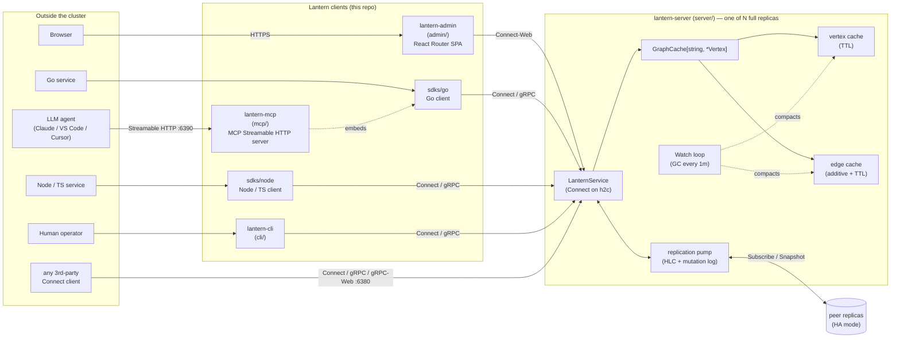
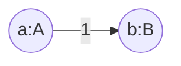
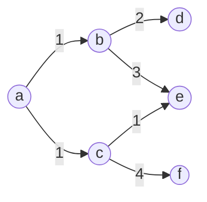
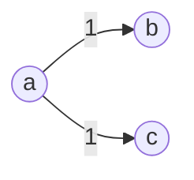
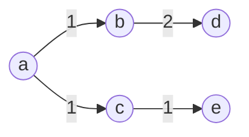
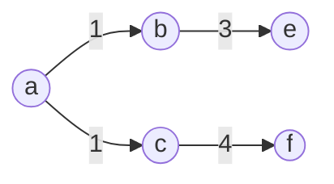

# Lantern — an in-memory graph-based key-vertex store


Lantern is a **time-decaying, in-memory graph KVS** served over the
[Connect protocol](https://connectrpc.com/) (with gRPC and gRPC-Web wire
compatibility on the same h2c socket). It behaves like a key-value store —
values are *vertices* — and lets you walk the relationships between them in
real time. Both vertices **and edges** carry their own TTLs, so the graph
naturally forgets old information the same way real-world relationships fade.

It is not an ontology engine, not a global-shortest-path solver, and not a
disk-backed graph database. It is the small, hot, online piece you put in front
of those systems so request-path code can ask *"who is this user related to
right now, and how strongly?"* in a single millisecond-scale RPC.


---

## Why Lantern is different

Most graph stores are optimized for offline analytics on a snapshot of "what
the graph looked like yesterday." Lantern is built around three properties that
together make it well suited to **online, behavioral** workloads:

### 1. Time-decaying graph (per-edge & per-vertex TTL)

Every vertex and every edge carries an independent expiration. A background
janitor (`Watch`) compacts expired entries and drops edges whose endpoints have
disappeared. There is no manual deletion required to keep the working set warm
and small.

### 2. Additive edge weights with independent expiration

Edges are not single scalars — each `AddEdge(tail, head, w, ttl)` call appends
**another contribution** with its own TTL. The reported weight is the live sum
of contributions that have not yet expired.

```text
t=0   AddEdge(a, b, 1.0, 3s)   →  weight(a,b) = 1
t=1   AddEdge(a, b, 1.0, 3s)   →  weight(a,b) = 2   (two contributions live)
t=3   first contribution expires →  weight(a,b) = 1
t=4   second contribution expires →  weight(a,b) = 0   (edge gc'd)
```

This is the model you actually want for behavioral signals: every click, view,
or co-occurrence event simply gets appended; "how strong is this relationship
*right now*" falls out of the math, no batch job required. Use `PutEdge` when
you want classic idempotent replace instead.

### 3. Built-in online graph algorithms over the live snapshot

A single `Illuminate` RPC walks the live graph from a seed vertex and returns
a subgraph already shaped for your use case. Three orthogonal axes select the
shape (#410):

| Axis | Values | What it does |
|---|---|---|
| `algorithm` | `none` (default) — raw k-NN subgraph<br>`mst` — spanning tree<br>`spt` — shortest-path tree from seed | Picks the post-traversal subgraph reduction |
| `objective` | `min` (default) — smallest-weight tree wins<br>`max` — largest-weight tree wins | Picks the direction of the reduction. Ignored when `algorithm=none` |
| `weighting` | `raw` (default) — edge.weight verbatim<br>`tfidf` — per-hop top-k weighted by `w / log2(1+df(head))` | Picks the edge-weight transform applied BEFORE the BFS walk |

Examples:

- `algorithm=mst objective=min`  — clustering / dedup (smallest connecting tree)
- `algorithm=mst objective=max`  — strongest-relationship backbone
- `algorithm=spt objective=min`  — low-cost reachability
- `algorithm=spt objective=max`  — **most-relevant** path tree
- `weighting=tfidf`              — suppress hub vertices like "popular" items

You don't fetch a wall of edges and post-process — the server returns exactly
the shape you asked for.

---

## When to use it (and when not)

**Good fit**

- **Real-time recommenders** — user → item interaction graph with decaying
  weights; `illuminate(user, step=2, k=10, weighting=tfidf)` gives a candidate set
  that already discounts popular items.
- **Session-aware personalization** — short-TTL session graph layered on top
  of long-TTL preference graph in the same store.
- **Fraud / abuse co-occurrence signals** — accounts, devices, IPs as
  vertices; suspicious co-occurrences as additive edges that decay so old
  noise self-cleans.
- **Trend & "what's hot" detection** — edges from query → result tick up on
  each interaction and naturally fall off when the trend dies.
- **Short-term knowledge graph for LLM / agent context** — keep
  entity-relation cache scoped to a session TTL; query with `Illuminate` to
  build prompt context.
- **Online graph features for ML** — neighborhood aggregations served at
  request time instead of from a feature store batch.

**Not a good fit**

- Anything that needs **durability** out of the box. Lantern is in-memory only
  — a restart loses the graph. Replay your event stream into it on boot, or
  put a queue in front.
- Global graph analytics (PageRank over the whole graph, community detection
  across billions of edges, etc.).
- Massive working sets that don't fit in one process's RAM. Lantern has
  built-in leaderless **replication** for HA (every replica holds the full
  graph — see [docs/replication.md](docs/replication.md)), but no sharding:
  the working set must fit in one process.
- Strong-consistency multi-writer scenarios. The store is a leaderless
  full-replica cache with last-writer-wins per key under an HLC clock, not a
  linearizable distributed database.

---

## Architecture at a glance



- **One wire surface for everything.** The server's `:6380` listener accepts
  Connect, gRPC, and gRPC-Web on the same h2c socket, so the Admin SPA (via
  Connect-Web), the Go and Node SDKs, the CLI, and the MCP server all share
  the exact same RPC contract from `proto/graph/v1/`.
- **lantern-mcp** ([`mcp/`](mcp/)) — exposes Lantern as **decaying graph
  memory** to LLM agents over MCP Streamable HTTP (default `:6390`, endpoint
  `/mcp`). Depends on `pb/` and
  `sdks/go/` only; ships as the `ghcr.io/anaregdesign/lantern-mcp` container
  on `mcp/vX.Y.Z` tags.
- **lantern-admin** ([`admin/`](admin/)) — browser-only React Router /
  Fluent UI / Sigma.js control surface. Talks Connect-Web straight to the
  server (no backend of its own) and ships as the
  `ghcr.io/anaregdesign/lantern-admin` container on `admin/vX.Y.Z` tags.
  Requires the server's `LANTERN_CORS_ALLOWED_ORIGINS` to include the admin
  origin.
- **HA mode (optional).** Every replica holds the **full** graph. Writes
  commit locally on the receiving pod and then fan out asynchronously to all
  peers via `Subscribe` / `Snapshot` RPCs tagged with HLC timestamps. No
  leader, no quorum, no external storage. External CDC consumers attach
  `Subscribe` to **any one replica** and observe every cluster mutation
  (leaderless Subscribe contract — see #415 / `docs/replication.md` §8.2);
  per-origin resume cursor (`from_seq_per_origin`) lets a consumer fail
  over between replicas without seq remapping. See
  [`docs/replication.md`](docs/replication.md) for the RFC and
  [`docs/ha-runbook.md`](docs/ha-runbook.md) for the operator playbook.
- **DI**: [google/wire](https://github.com/google/wire) — see
  [server/cmd/wire.go](server/cmd/wire.go). Never edit `wire_gen.go` by
  hand; run `go generate ./...` after changing providers. The generic
  `GraphCache[S, T]` is instantiated as `GraphCache[string, *Vertex]` at
  the wire boundary because wire cannot synthesize generic type arguments.

---

## Quick start

### Run the server

```shell
docker run --rm -p 6380:6380 ghcr.io/anaregdesign/lantern:latest
```

Released images are published to `ghcr.io/anaregdesign/lantern` on every
`vX.Y.Z` git tag. **Both** tag families are available from `v0.8.0` onward:

- `vX.Y.Z` / `vX.Y` / `vX` — matches the git tag and `gh release` URL.
- `X.Y.Z` / `X.Y` / `X` — bare SemVer (the only form for `v0.5.0`–`v0.7.0`).

Plus `latest` (most recent release) and `sha-<short>` for each build.

Or build from source:

```shell
go run ./server/cmd          # listens on :6380
```

### Run on Kubernetes (HA mode)

For Tier-A HA (3 replicas with DNS-based peer discovery, anti-entropy
reconciliation, and a `PodDisruptionBudget`) install the bundled Helm
chart:

```shell
helm install lantern deploy/helm/lantern
# Or render without installing:
helm template lantern deploy/helm/lantern | less
```

The chart creates a `StatefulSet`, a headless `Service` for peer
discovery (`replication.discovery.mode=dns`), a `ClusterIP` `Service`
for clients (Connect/gRPC/gRPC-Web on `:6380`), and an optional `ServiceMonitor`. See
[`deploy/helm/lantern/README.md`](deploy/helm/lantern/README.md) for
the full values reference and
[`docs/replication.md` §9.1](docs/replication.md#91-peer-discovery-190)
for the discovery semantics.

### Run with Docker Compose + open the Admin UI

The fastest way to get a running cluster **and** a browser console in front of
it is the Compose stack in [`deploy/compose/`](deploy/compose/). One `up`
brings up a 3-replica HA cluster, the [`lantern-admin`](admin/) SPA, and
Prometheus — no local build required:

```shell
cd deploy/compose
# Pull published images for the server and the Admin SPA, then start the stack.
LANTERN_IMAGE=ghcr.io/anaregdesign/lantern:latest docker compose up -d
```

Then open the Admin in your browser:

**→ <http://localhost:8080>**

That's the whole flow — the SPA loads immediately and is ready to
`Illuminate`, browse, and run ops against the live cluster. The Admin talks
Connect-Web straight to a lantern node; the **Gateway** button in the
top-right header selects which replica it hits, defaulting to
`http://localhost:6380` (`lantern-0`) — switch to `:6381` / `:6382` for the
other two. Each replica ships
`LANTERN_CORS_ALLOWED_ORIGINS=http://localhost:8080` so the browser preflight
from the Admin origin is allowed out of the box. Tear the stack down with
`docker compose down -v`.

> **Iterating on the server itself?** The `lantern` service defaults to the
> locally-built `lantern:local` tag, so build it once from the repo root
> (`docker build -t lantern:local .`) and drop the `LANTERN_IMAGE` override to
> run the cluster against your own changes.

Under the hood the canonical compose declares three explicit
`lantern-{0,1,2}` services with pinned host ports (`6380`, `6381`, `6382`)
since [#435](https://github.com/anaregdesign/lantern/issues/435), so the
Admin's default gateway and any direct curls land on a stable replica across
`up`/`down` cycles. All three join the same `lantern` DNS alias, so peer
discovery and Compose-side round-robin still work unchanged. Prometheus on
`:9091` scrapes every replica via DNS SD. See
[`deploy/compose/README.md`](deploy/compose/README.md) for the full port
table and client LB options, and the [Helm chart](deploy/helm/lantern/) when
you need more than three replicas.

### Run on serverless container PaaS

For Cloud Run / Azure Container Apps / AWS App Runner / Fly Machines /
any platform without stable pod identities, deploy a **single
instance** (or independent shards) without setting any `LANTERN_PEER_*`
env. Peer discovery requires a stable in-cluster DNS that resolves to
per-pod IPs, which these platforms do not provide. See the
[HA runbook](docs/ha-runbook.md) for the per-platform topology matrix,
signals to watch, partition behaviour, and recovery procedures.

### Use the CLI

Pre-built binaries for Linux, macOS, and Windows (amd64 + arm64) are
attached to every [GitHub Release](https://github.com/anaregdesign/lantern/releases).

```shell
# macOS (Apple Silicon) — replace VERSION with the release tag, e.g. v0.6.0
VERSION=v0.6.0
curl -L -o lantern-cli.tar.gz \
  "https://github.com/anaregdesign/lantern/releases/download/${VERSION}/lantern-cli_${VERSION#v}_Darwin_arm64.tar.gz"
tar -xzf lantern-cli.tar.gz lantern-cli
./lantern-cli version
```

Archive naming: `lantern-cli_<version>_<Linux|Darwin|Windows>_<x86_64|arm64>.tar.gz`
(`.zip` on Windows). A `checksums.txt` is published alongside the archives.

Or build from source:

```shell
go build -o lantern ./cli
./lantern --help
```

The CLI ships an interactive REPL (`lantern repl`) plus a scriptable
subcommand for every RPC (`lantern vertex put`, `lantern edge add`,
`lantern illuminate`, …). The REPL is the fastest way to poke at a running
server; the one-shot subcommands are what you reach for when you want
batch writes, prefix scans, NDJSON bulk loads, gzip compression, TLS
flags, or typed values — features the REPL grammar intentionally does
not cover. Every subcommand has long-form, LLM-friendly help text
(`lantern <cmd> --help`); read commands emit JSON on stdout and write
commands print `OK`.

A REPL session that exercises the full vertex/edge/illuminate surface:

```text
$ ./lantern repl
> put vertex alice Alice                # value parsed as string
OK (1.2ms)
> put vertex bob Bob 3600               # third arg = TTL seconds
OK (0.9ms)
> put vertex lamp Lamp 3600
OK (0.8ms)

> add edge alice bob 1.5 3600           # additive: appends a contribution
OK (1.1ms)
> add edge alice bob 0.5 3600           # second contribution
OK (0.8ms)
> get edge alice bob                    # live sum of unexpired contributions
2.000000
OK (0.6ms)

> put edge alice lamp 0.7 3600          # idempotent: replaces any existing weight
OK (1.0ms)

> get vertex alice                      # value, JSON-encoded oneof wrapper
{"String_":"Alice"}
OK (0.6ms)

> illuminate alice 2 5                                   # 2 hops, top-5 neighbours/hop, raw subgraph
{
        "vertices": { ... },
        "edges":    { ... }
}
OK (2.3ms)
> illuminate alice 3 8 algorithm=spt objective=max weighting=tfidf
                                        # SPT under TF-IDF weighting, relevance-maximising
{ ... }
OK (3.1ms)
> illuminate alice 3 8 algorithm=mst objective=max
                                        # maximum spanning tree from the seed
{ ... }
OK (2.7ms)

> delete edge alice bob
OK (0.7ms)
> delete vertex alice
OK (0.6ms)
> exit
```

REPL grammar (full reference in `lantern repl --help`, or type `help`
inside the prompt to print it into the scrollback):

```text
get    vertex <key>
put    vertex <key> <value> [ttl_seconds]
delete vertex <key>
get    edge   <tail> <head>
add    edge   <tail> <head> <weight> [ttl_seconds]
put    edge   <tail> <head> <weight> [ttl_seconds]
delete edge   <tail> <head>
illuminate <seed> <step> <k> [algorithm=none|mst|spt] [objective=min|max] \
           [weighting=raw|tfidf]
help
exit
```

Tokens are whitespace-delimited and quotable — wrap a value in
`"double quotes"` for C-style escapes (`\"`, `\\`, `\n`, `\r`, `\t`)
or `'single quotes'` to carry the payload verbatim (no escapes). Verb
and objective tokens are matched case-insensitively (`Get VERTEX foo`
works); positional arguments preserve case (`put vertex CamelKey
CamelValue` stores `CamelKey` / `CamelValue`).

For everything outside that grammar — batch writes, prefix scans, bulk
loads, gzip/TLS, typed values — use the one-shot subcommands:

```shell
# typed values, explicit TTL
./lantern vertex put alice '{"name":"Alice"}' --value-type json --ttl 1h

# batched and streamed
./lantern vertex delete alice bob carol            # batch DeleteVertices
cat edges.ndjson | ./lantern bulk edges add -      # streamed AddEdges

# prefix scan / count / bulk-delete
./lantern vertex count  users/
./lantern vertex scan   users/ --all > snap.ndjson
./lantern vertex delete-prefix tmp/ --dry-run

# edge scan
./lantern edge scan --tail-prefix user: --head-prefix post:

# TLS / mTLS
./lantern --tls --tls-ca ./ca.pem -H lantern.example.com -p 443 vertex get alice
```

Global flags include `--host/--port` (or `--address`), `--timeout`, `--tls*`,
`--compression {none|gzip}`, and `--chunk-size`. Exit code `0` is success,
`1` is a local / parse error, `2` is an RPC error from the server.

### Use it from Go

The Go client SDK is its own module, so external projects pull only Connect-Go
and protobuf — nothing from `server/`, `cli/`, or `core/`:

```shell
go get github.com/anaregdesign/lantern/sdks/go
```

```go
import "github.com/anaregdesign/lantern/sdks/go"

cli, err := client.NewLantern("localhost:6380")
if err != nil { log.Fatal(err) }
defer cli.Close()

ctx := context.Background()

// Vertices accept string, int (signed/unsigned), float, bool, time.Time,
// time.Duration, []byte, or nil.
_ = cli.PutVertex(ctx, "user:42", "alice", 1*time.Hour)
_ = cli.PutVertex(ctx, "item:7",  "lamp",  1*time.Hour)

// Each AddEdge appends a contribution with its own TTL.
_ = cli.AddEdge(ctx, "user:42", "item:7", 1.0, 30*time.Minute)

// Walk: 2 hops, top-3 per hop, TF-IDF weighted.
g, _ := cli.Illuminate(ctx, "user:42",
    client.WithStep(2), client.WithK(3), client.WithWeighting(client.WeightingTFIDF))

// Prefix scan: enumerate every vertex under a namespace, auto-paginated.
for batch, err := range cli.ScanVerticesAll(ctx, "user:", 100) {
    if err != nil { log.Fatal(err) }
    for _, v := range batch { fmt.Println(client.StringValue(v)) }
}

// Count or bulk-delete by prefix (DeleteVerticesByPrefix supports WithDryRun).
n, _ := cli.CountVerticesByPrefix(ctx, "session:abc:")
_, _ = cli.DeleteVerticesByPrefix(ctx, "session:abc:")

// Edge prefix scan: filter on tail and/or head namespace.
edges, _, _ := cli.ScanEdges(ctx,
    client.WithEdgeScanTailPrefix("user:"),
    client.WithEdgeScanHeadPrefix("post:"),
    client.WithEdgeScanLimit(100))
_ = edges
```

The full multi-type, additive-edge, and `Illuminate` example lives in
[sdks/go/example/main.go](sdks/go/example/main.go).

### Use it from Node / TypeScript

The Node / TypeScript client ships to npm as [`lantern-sdk`](sdks/node/)
(ESM + CJS, bundled TypeScript types, Node 20+):

```shell
npm install lantern-sdk      # or: bun add lantern-sdk / pnpm add lantern-sdk
```

```ts
import { Algorithm, connect } from "lantern-sdk";

const client = connect("http://localhost:6380");
try {
  await client.putVertex({ key: "user:42", value: "alice", ttlSeconds: 3600 });

  // Each addEdge appends a contribution with its own TTL.
  await client.addEdge({ tail: "user:42", head: "item:7", weight: 1.0, ttlSeconds: 1800 });

  // Walk: 2 hops, top-16 per hop.
  const graph = await client.illuminate("user:42", { step: 2, k: 16, algorithm: Algorithm.UNSPECIFIED });
  console.log(`vertices=${graph.vertices.size}`);

  // Prefix scan: async-iterate every vertex under a namespace, auto-paginated.
  for await (const page of client.scanVerticesAll("user:", 500)) {
    for (const v of page) console.log(v.key);
  }
} finally {
  client.close();
}
```

JS values map to typed proto fields (`string`, `number`, `bigint`, `boolean`,
`Date`, `Uint8Array`, `null`, plus `Int32` / `Uint32` / `Uint64` / `Float32` /
`Duration` wrappers); batch writes auto-chunk and throw `BatchError` (carrying
`.written`) on partial failure. The browser-only `lantern-sdk/web` subpath is
what powers the [admin SPA](admin/). See
[sdks/node/README.md](sdks/node/README.md) for the full API.

### Use it from another language

Generate bindings from [proto/graph/v1/graph.proto](proto/graph/v1/graph.proto)
with your favorite protoc plugin, [buf](https://buf.build), or one of the
[Connect codegen plugins](https://connectrpc.com/docs/). The primary
`LanternService` is unary; `LanternReplicationService.Subscribe` and
`Snapshot` are server-streaming. The server multiplexes Connect (JSON or
proto), gRPC, and gRPC-Web over the same `:6380` h2c socket, so any of those
three protocols works without a sidecar.

---

## Use as an MCP server

The [`mcp/`](mcp/) module ships **`lantern-mcp`**, a
[Model Context Protocol](https://modelcontextprotocol.io) server that turns
a running Lantern endpoint into **decaying graph memory** for LLM agents
(Claude Desktop, VS Code / Copilot, Cursor, …).

The pitch in one line: **facts decay on a TTL ladder; relations are additive
and decay independently**. Treating Lantern as a Redis-style KV with TTLs
misses the point — `recall_*` deliberately does NOT refresh TTL, and
`remember_relation` is Hebbian (writing the same relation twice strengthens
it). The agent learns which facts and relations are worth keeping by
reinforcing them; everything else dies on schedule.

`lantern-mcp` is **not** a replacement for the Go SDK, the gRPC surface, or
the CLI — it is the LLM-facing facade. Under the hood it dials Lantern with
the same SDK any other client uses; it never imports `server/` or `core/`.

### Tools

Six tools, advertised at session-open. Descriptions match those exposed via
MCP `tools/list` (see [mcp/server.go](mcp/server.go) for the source of truth).

| Tool | Purpose |
|---|---|
| `remember_fact` | Store a fact with a **required TTL bucket**. Re-writing the same key overwrites + resets TTL — the canonical way to refresh. |
| `recall_fact` | Look up a single fact. Returns `{found=false}` for misses (structured, not a tool error). Does NOT refresh TTL. |
| `forget` | Delete a fact by exact key. Idempotent. Edges incident to the key are NOT cascade-deleted; they decay on their own. |
| `list_under` | Enumerate facts whose key starts with a prefix, ascending. Defaults to 50, max 500. |
| `remember_relation` | Add or **reinforce** a directed relation. Additive: same write twice = stronger relation. |
| `recall_related` | Walk the graph from a seed with `step`, `k`, and the orthogonal axes `algorithm` (`none` / `mst` / `spt`), `objective` (`min` / `max`), and `weighting` (`raw` / `tfidf`) introduced in #410. |

A `ping` tool also exists so operators can sanity-check the wire without
touching state.

### TTL buckets

Every `remember_*` tool takes a **required** bucket parameter. Twelve enum
horizons covering "next breath" through "next quarter":

```
seconds → transient → turn → conversation → task → workday → day →
  week → sprint → month → quarter → durable
```

Defaults run from 30s to 180d and are all overridable via
`LANTERN_MCP_TTL_<BUCKET>` environment variables (see
[mcp/README.md](mcp/README.md#ttl-buckets-required-parameter-for-every-remember_-tool)
for the full table). When in doubt about which bucket to pick, choose the
shorter one — re-writing is cheap.

### Run the container

`lantern-mcp` serves MCP over **Streamable HTTP**: run it as a long-lived
process, then point your agent at `http://localhost:6390/mcp`.

```shell
# Pin to a release tag — never `:latest` for agent runtimes.
docker run --rm \
  -p 6390:6390 \
  -e LANTERN_ADDR=host.docker.internal:6380 \
  ghcr.io/anaregdesign/lantern-mcp:v0.4.0
```

The container binds `0.0.0.0:6390` internally so the published port is
reachable; the endpoint is **unauthenticated**, so only publish it on
trusted networks (the handler still applies cross-origin / DNS-rebinding
protection, and the bare binary defaults to loopback only). A `GET
/healthz` returns `200 ok` for liveness probes.

Images are published to `ghcr.io/anaregdesign/lantern-mcp` on every
`mcp/vX.Y.Z` git tag (independent of the server's release cadence). Both
`vX.Y.Z` and bare `X.Y.Z` tag forms are available, plus `latest` and
`sha-<short>`; each image is multi-arch (`linux/amd64` + `linux/arm64`)
and signed with cosign keyless.

### Client configs

Copy-paste snippets live in [`mcp/examples/`](mcp/examples/). Start the
server (above) first, then point the agent at the URL. The Claude Desktop
entry:

```json
{
  "mcpServers": {
    "lantern": {
      "url": "http://localhost:6390/mcp"
    }
  }
}
```

VS Code (`.vscode/mcp.json`, `"type": "http"`) and Cursor
(`~/.cursor/mcp.json`) take the same `url` shape. Hosts that only speak
stdio can bridge via `mcp-remote` — see
[mcp/examples/README.md](mcp/examples/README.md) for file locations, the
`mcp-remote` fallback, and `LANTERN_ADDR` tweaks for Linux / remote setups.

### Worked example: agent memory session

The interaction pattern that exercises Lantern's strengths is
**reinforce-then-recall** — short-TTL writes that accumulate into a
useful neighborhood:

```text
# 1. Capture facts as they arise. Bucket is required; prefer SHORTER.
remember_fact(key="user:alice/role",      value="staff eng",     bucket="quarter")
remember_fact(key="user:alice/team",      value="payments",      bucket="month")
remember_fact(key="topic:payments/owner", value="alice",         bucket="month")

# 2. Reinforce relations every time they show up in the conversation.
#    Each call APPENDS a contribution — repeated co-occurrence builds weight.
remember_relation(tail="user:alice", head="topic:payments", weight=1.0, bucket="day")
remember_relation(tail="user:alice", head="topic:payments", weight=1.0, bucket="day")
remember_relation(tail="user:alice", head="topic:auth",     weight=0.4, bucket="day")

# 3. Later in the session, walk the live graph. SPT-max-weight returns
#    a "most relevant" tree — exactly what you want for grounding context.
recall_related(seed="user:alice", step=2, k=5, algorithm="spt", objective="max")
# → [{key: "topic:payments", weight: 2.0}, {key: "topic:auth", weight: 0.4}, …]
```

Two recurring traps worth memorising:

- **`recall_*` does NOT refresh TTL.** A frequently-read but never-rewritten
  fact will still decay. The canonical idiom is *"recall, then if you want
  it to stick around, `remember_fact` again with the same key."*
- **`remember_relation` is additive, not idempotent.** Re-writing the same
  edge strengthens it; that is the design. Use the relation's TTL bucket as
  a half-life knob — short buckets give you a "what's hot right now" view,
  long buckets give you "what has this user historically cared about."

### Docs and references

- Operator / contributor reference: [mcp/README.md](mcp/README.md).
- Server-instructions string the LLM sees at session-open:
  [mcp/server.go](mcp/server.go) (`serverInstructions` constant).
- Container build + publish pipeline:
  [.github/workflows/mcp-publish.yml](.github/workflows/mcp-publish.yml).
- Integration test that wires the MCP server against an in-process Lantern:
  [tests/integration/mcp_test.go](tests/integration/mcp_test.go).

---

## gRPC surface

Defined in [proto/graph/v1/graph.proto](proto/graph/v1/graph.proto), served by
[server/service/service.go](server/service/service.go).

Every read, write, and delete operation has both a **singular** and a **plural**
form. The plural is the canonical implementation; the singular is a thin facade
that forwards a one-element batch to the plural handler. Pick whichever reads
better at the call site. `Illuminate` is the lone exception — it returns a
whole subgraph, so there is no plural form.

| RPC | Purpose | Notes |
|---|---|---|
| `GetVertex` / `GetVertices` | Fetch one or many vertices by key | Singular returns `NotFound` if expired/missing; plural reports missing keys in `Missing` and never errors on partial misses |
| `PutVertex` / `PutVertices` | Upsert vertices with TTL | Last write wins; plural is the canonical handler, singular forwards a one-element batch; SDK auto-chunks at `WithBatchChunkSize`, server enforces `LANTERN_MAX_BATCH_SIZE` |
| `DeleteVertex` / `DeleteVertices` | Remove vertices | Edges to/from them are pruned on the next GC tick (`LANTERN_GC_INTERVAL_SECONDS`, default 60s); SDK auto-chunks; idempotent (safe to retry) |
| `GetEdge` / `GetEdges` | Read current live weight(s) | Sum of unexpired contributions; plural takes `[]EdgeRef{Tail, Head}` and reports gaps in `Missing` |
| `AddEdge` / `AddEdges` | **Append** weighted contributions | Not idempotent — see *Additive edge weights* above; SDK auto-chunks; server enforces `LANTERN_MAX_BATCH_SIZE` |
| `PutEdge` / `PutEdges` | Idempotent replace (delete + add under one write lock) | Use when you want one-and-only-one weight; SDK auto-chunks; server enforces `LANTERN_MAX_BATCH_SIZE` |
| `DeleteEdge` / `DeleteEdges` | Remove edges outright | Plural takes `[]EdgeRef{Tail, Head}`; SDK auto-chunks; idempotent |
| `ScanVertices` | Enumerate vertices by key prefix, page-by-page | Opaque cursor; server enforces a default and hard cap on `limit` (see `LANTERN_SCAN_*`); cross-feeding a cursor from a different `Scan*` RPC is rejected with `InvalidArgument`; SDK helper `ScanVerticesAll` returns an `iter.Seq2` that auto-paginates |
| `CountVerticesByPrefix` | Count live vertices under a prefix | Radix-only (cheap); not subject to `limit` |
| `DeleteVerticesByPrefix` | Bulk-delete a namespace | Capped by server-configured `limit`; `dry_run` returns the count that *would* be deleted without mutating; edges incident to removed vertices are reaped on the next GC tick |
| `ScanEdges` | Enumerate edges by `tail_prefix` AND `head_prefix` | Either prefix may be empty; head dimension is served by a per-tail head radix (not a post-filter); head-only scans still iterate every tail, so combining both prefixes is the most efficient shape; same opaque-cursor / cross-RPC rejection rules as `ScanVertices`; SDK helper `ScanEdgesAll` auto-paginates |
| `Illuminate` | Walk the graph from a seed | `WithStep`, `WithK`, `WithAlgorithm` (none / MST / SPT), `WithObjective` (min / max), `WithWeighting` (raw / TF-IDF); honours `ctx` cancellation; `step`/`k` are clamped at `LANTERN_ILLUMINATE_MAX_STEP` / `LANTERN_ILLUMINATE_MAX_K`. See #410. |

Vertices auto-materialize on `AddEdge`/`PutEdge` if the endpoint key does not
yet exist (they get the edge's expiration as their TTL). This keeps event-stream
ingestion simple — you only need to issue edge writes.

All requests pass through a server-side validation interceptor that enforces
`LANTERN_MAX_KEY_LEN`, `LANTERN_MAX_BATCH_SIZE`, and rejects NaN/Inf weights —
oversize or malformed requests fail fast with `InvalidArgument` before touching
the cache.

Browser clients reach the same RPCs via Connect-Web (and gRPC-Web) on the
same `:6380` listener — no separate HTTP/JSON gateway is involved. See the
[admin SPA](admin/) for a worked example.

---

## Configuration

The server is configured via environment variables, parsed in
[server/provider/provider.go](server/provider/provider.go):

| Variable | Default | Meaning |
|---|---|---|
| `LANTERN_PORT` | `6380` | Primary RPC listen port (Connect / gRPC / gRPC-Web multiplexed) |
| `LANTERN_DEFAULT_TTL_SECONDS` | `60` | Surfaced in `GetServerStatus`/startup logs only; **not** applied to RPC writes — a write that omits TTL/expiration is stored permanently (decay is opt-in per write, #523). |
| `LANTERN_GC_INTERVAL_SECONDS` | `60` | Cache GC tick interval |
| `LANTERN_LOG_LEVEL` | `info` | `debug` / `info` / `warn` / `error` |
| `LANTERN_LOG_FORMAT` | `json` | `json` or `text` (slog handler) |
| `LANTERN_METRICS_ADDR` | `:9090` | Address for Prometheus + health HTTP; empty disables |
| `LANTERN_CORS_ALLOWED_ORIGINS` | _(empty)_ | Comma-separated CORS allow-list for the primary `:6380` listener (e.g. `http://localhost:5173,https://admin.example.com`). Empty disables CORS. `*` is honoured only when sole entry. |
| `LANTERN_REFLECTION` | `true` | Register gRPC server reflection (useful for `grpcurl`) |
| `LANTERN_SHUTDOWN_TIMEOUT_SECONDS` | `30` | Upper bound on graceful shutdown before forcing `http.Server.Close()` |
| `LANTERN_MAX_RECV_MSG_BYTES` | `16777216` | Per-RPC inbound message limit (16 MiB default) |
| `LANTERN_MAX_SEND_MSG_BYTES` | `16777216` | Per-RPC outbound message limit |
| `LANTERN_MAX_CONCURRENT_STREAMS` | `1024` | Upper bound on concurrent streams per HTTP/2 connection |
| `LANTERN_RATE_LIMIT_RPS` | `0` | Global token-bucket rate limit; `0` disables |
| `LANTERN_RATE_LIMIT_BURST` | `2×RPS` | Burst capacity for the rate limiter; falls back to `2×RPS` if set to `0` while a limit is active |
| `LANTERN_MAX_KEY_LEN` | `1024` | Reject vertex/edge keys longer than this (validation interceptor) |
| `LANTERN_MAX_BATCH_SIZE` | `10000` | Reject batch Put/Add requests over this size |
| `LANTERN_SCAN_DEFAULT_LIMIT` / `LANTERN_SCAN_MAX_LIMIT` | `1000` / `10000` | Default page size and hard cap for `ScanVertices` / `ScanEdges` |
| `LANTERN_DELETE_BY_PREFIX_DEFAULT_LIMIT` / `LANTERN_DELETE_BY_PREFIX_MAX_LIMIT` | `10000` / `100000` | Default and hard cap for `DeleteVerticesByPrefix` per call |
| `LANTERN_ILLUMINATE_MAX_STEP` | `16` | Cap on BFS depth accepted by `Illuminate` |
| `LANTERN_ILLUMINATE_MAX_K` | `1024` | Cap on neighbours-per-step accepted by `Illuminate` |
| `LANTERN_TLS_CERT_FILE` | _(unset)_ | Server certificate; enables TLS when set with key |
| `LANTERN_TLS_KEY_FILE` | _(unset)_ | Server private key |
| `LANTERN_TLS_CLIENT_CA_FILE` | _(unset)_ | Client CA bundle; enables mTLS (`RequireAndVerifyClientCert`) when set |
| `LANTERN_TOMBSTONE_TTL` | `24h` | Replication tombstone retention window. While the tombstone is live, any incoming `AddEdge`/`PutEdge`/`PutVertex` (including peer-replayed mutations via `ApplyMutation`) with an HLC strictly older than the delete is dropped, so deletes converge across nodes even under reorder. Mutations whose `Expiration` exceeds this TTL are rejected with `InvalidArgument`. Set to `0` to disable tombstones entirely (legacy behaviour; delete-then-re-add reorders may resurrect data). |

## Observability

Lantern ships production-grade observability out of the box:

- **Structured logging** via `log/slog` — JSON by default, with per-RPC
  start/finish events emitted by a Connect logging interceptor
  ([`server/provider/connect_middleware.go`](server/provider/connect_middleware.go)).
- **Prometheus metrics** — RPC metrics exposed by the in-house Connect
  interceptor
  ([`server/provider/connect_middleware.go`](server/provider/connect_middleware.go))
  that reproduces the canonical `grpc-ecosystem/go-grpc-middleware` metric
  names (`grpc_server_started_total`, `grpc_server_handled_total`,
  `grpc_server_handling_seconds_*`). The names are intentionally retained
  so existing scrape configs and Grafana dashboards keep working; the
  underlying middleware itself was deleted with the rest of the gRPC stack
  in #337/#352. Go runtime + process collectors are
  also registered and the whole lot is served on `LANTERN_METRICS_ADDR`
  at `/metrics`. Lantern also publishes its own domain collectors so you
  can chart cache load and GC pressure directly:

  | Metric | Type | Labels | Description |
  |---|---|---|---|
  | `lantern_vertices` | gauge | — | Live vertex count in the in-memory cache. |
  | `lantern_edges` | gauge | — | Live edge count in the in-memory cache. |
  | `lantern_ttl_expirations_total` | counter | `kind` (`vertex`, `edge`, `dangling_edge`) | Entries reaped per GC tick, partitioned by kind. |
  | `lantern_gc_duration_seconds` | histogram | — | Wall-clock duration of a single GC tick (buckets `0.1ms..~1.6s`). |
  | `lantern_build_info` | gauge (=1) | `version`, `commit`, `go_version` | Build metadata for the running server. |
- **Health checks** — the standard `grpc.health.v1.Health` service
  (served via [`connectrpc.com/grpchealth`](https://pkg.go.dev/connectrpc.com/grpchealth)
  on `:6380`, reachable by Connect / gRPC / gRPC-Web clients alike) plus
  HTTP `/healthz` and `/readyz` on the metrics listener, so both
  Kubernetes probes and `grpc_health_probe` work.
- **Distributed tracing** — OpenTelemetry server instrumentation via
  `otelhttp.NewHandler` wrapped around the h2c listener, so every Connect,
  gRPC, and gRPC-Web request gets a span. Set `OTEL_EXPORTER_OTLP_ENDPOINT`
  (or `OTEL_EXPORTER_OTLP_TRACES_ENDPOINT`) to install an OTLP exporter and
  start shipping spans; without it the global tracer provider stays at noop
  so there is zero export overhead. `OTEL_EXPORTER_OTLP_PROTOCOL` selects
  `grpc` (default) or `http/protobuf`, and all standard OTel SDK env vars
  (`OTEL_EXPORTER_OTLP_HEADERS`, `OTEL_EXPORTER_OTLP_INSECURE`,
  `OTEL_EXPORTER_OTLP_TIMEOUT`, …) are honoured. The tracer provider is
  flushed on graceful shutdown.
- **gRPC reflection** — the v1 and v1alpha reflection services are
  registered via [`connectrpc.com/grpcreflect`](https://pkg.go.dev/connectrpc.com/grpcreflect)
  by default (handy for `grpcurl`); turn them off with
  `LANTERN_REFLECTION=false` for hardened deployments.
- **Keepalive + panic recovery** — sensible HTTP/2 keepalive parameters
  are applied at the listener, and a Connect recovery interceptor turns
  panics into `Internal` status responses with a logged stack trace
  instead of crashing the process.

---

## Repository layout

This is a monorepo consolidating four formerly separate repositories (Go) plus a browser-only admin SPA and a Node/TS SDK. The Go pieces are stitched together as a 6-module Go workspace so each can be consumed independently; the TypeScript pieces live outside `go.work` and ship on their own release cadence.

| Path | Module | Role |
|---|---|---|
| `pb/` | `github.com/anaregdesign/lantern/pb` | Generated protobuf messages and Connect-Go service stubs (under `graph/v1/graphv1connect/`). Shared contract — `server/`, `sdks/go/`, and `mcp/` all depend on it. |
| `core/` | `github.com/anaregdesign/lantern/core` | Shared building blocks: graph algorithms, TTL caches, collections, concurrency, NLP. |
| `sdks/go/` | `github.com/anaregdesign/lantern/sdks/go` | Go client SDK — depends on `pb/` only. |
| `sdks/node/` | `lantern-sdk` (npm) | Node.js / TypeScript client built on `@connectrpc/connect-node`. Not a Go module; Bun-managed (same version pin as `admin/`). |
| `server/` | `github.com/anaregdesign/lantern/server` | gRPC server (DI via google/wire) — depends on `pb/` + `core/`, **not** on the client SDK. |
| `mcp/` | `github.com/anaregdesign/lantern/mcp` | MCP server binary that exposes Lantern as decaying graph memory to LLM agents. Depends on `pb/` + `sdks/go/` only; ships as the `ghcr.io/anaregdesign/lantern-mcp` container on `mcp/vX.Y.Z` tags. |
| `admin/` | (TypeScript) | Browser-only React Router / Fluent UI / Sigma.js control surface. Not a Go module and not part of `go.work`; talks Connect-Web straight to the server. Ships as the `ghcr.io/anaregdesign/lantern-admin` container on `admin/vX.Y.Z` tags. |
| `.` (root) | `github.com/anaregdesign/lantern` | Umbrella module hosting `cli/` (cobra + promptui) and `tests/integration/` (cross-module bufconn tests). |
| `proto/` | (no Go module) | `.proto` sources — formerly `lantern-proto`. |
| `go.work` | — | Pins the 6 Go modules for local dev. The TS pieces (`admin/`, `sdks/node/`) sit outside it. |

Dependency direction is a strict DAG: `pb` and `core` are leaves; `sdks/go` → `pb`; `server` → `pb`, `core`; `mcp` → `sdks/go` → `pb`; root → all five Go submodules. The TS pieces (`admin/`, `sdks/node/`) consume `proto/` at codegen time but have no build-time dependency on any Go module.

---

## Developing on Lantern

```shell
make build       # go build -v ./...
make test        # go test -v ./...
make test-race   # go test -race -shuffle=on -covermode=atomic ./...
make fmt         # gofmt -s -w .
make vet         # go vet ./...
make generate    # go generate ./...  (runs wire + buf — no install required)
make wire        # alias: go tool wire ./server/cmd
make proto       # alias: buf generate (uses system `buf` if present, else `go run`; no --clean — it would wipe pb/go.mod)
make vuln        # govulncheck ./...
make tidy        # go mod tidy
```

Codegen is one command:

```shell
go generate ./...
```

This regenerates both `server/cmd/wire_gen.go` and everything under `pb/`.
No CLIs need to be installed up front:

- **wire** is wired in via the `tool` directive in `go.mod` — `go tool wire`
  just works after `go mod download`.
- **buf** is invoked via `go run github.com/bufbuild/buf/cmd/buf@v1.70.0` when
  no system `buf` is on `PATH`. Installing `buf` locally only makes the first
  invocation faster; correctness is identical.

Required toolchain:

- **Go 1.26** — kept in lockstep across `go.mod`, the Dockerfile
  (`golang:1.26-alpine`), and `.github/workflows/go.yml`. Bumping the version
  means bumping all three.

### Conventions and gotchas

- **High availability / replication** — Lantern's leaderless full-replica
  design (HLC, mutation log, Subscribe/Snapshot, tombstones, deployment
  topology matrix) is specified in [docs/replication.md](docs/replication.md).
  Operator-facing playbook (signals, partition recovery, upgrades,
  per-platform deploy) is in [docs/ha-runbook.md](docs/ha-runbook.md).
  All HA-tagged issues implement against that RFC.
- **Never hand-edit `server/cmd/wire_gen.go`** — it is generated. Edit providers
  in [server/provider/provider.go](server/provider/provider.go) or definitions
  in [server/cmd/wire.go](server/cmd/wire.go), then re-run `go generate ./...`
  (or `make wire` for just the wire step).
- **wire + generics** — wire cannot synthesize generic type arguments, so the
  provider returns the concrete `*graph.GraphCache[string, *Vertex]`. Re-check
  this constraint before introducing generics there.
- **Adding a new vertex value type** in the Go SDK requires updating *three*
  call sites in [sdks/go/value.go](sdks/go/value.go): `nativeVertex.asVertex`
  (Go → proto), the matching `*Value(v)` free function plus its `VertexKind*`
  constant and `Kind` switch entry (proto → Go), and the `MarshalVertexJSON`
  switch (proto → JSON). Accessors are package-level functions, not methods —
  `client.Vertex` is a true alias of `pb.Vertex`.
- **Proto `go_package`** is `github.com/anaregdesign/lantern/pb/graph/v1`.
  `make proto` rewrites everything under `pb/`.
- **Not every `*Response` message has a `Status` field** — check
  [`pb/graph/v1/graph.pb.go`](pb/graph/v1/graph.pb.go) before patching
  response types.
- **Test coverage** — `server/service/service_test.go` exercises the gRPC
  surface (vertex/edge CRUD, singular-write facades, `Illuminate`
  optimizations, context cancellation); `sdks/go/` has unit tests for value
  conversion and the client wrapper; `tests/integration/` wires the real
  server over bufconn to cover SDK-as-consumer paths. The remaining gap is
  end-to-end wire wiring (`server/cmd`). Add at least a minimal table test in
  the same PR for non-trivial changes.

### CI / release

- [`.github/workflows/go.yml`](.github/workflows/go.yml) runs `go build` + `go
  test` on every PR/push (Go 1.26).
- [`.github/workflows/docker-publish.yml`](.github/workflows/docker-publish.yml)
  publishes to `ghcr.io/anaregdesign/lantern` on `v*.*.*` tag pushes and signs
  the image with cosign (keyless, `--yes`).

---

## CLI cheatsheet

These commands are accepted by the interactive REPL (`./lantern repl`). The
cobra subcommands (`./lantern vertex put …`, `./lantern edge add …`, etc.)
shown earlier accept the same arguments.

```shell
put vertex <key:string> <value:string> [<ttl:int>]
put edge   <tail:string> <head:string> <weight:float> [<ttl:int>]
add edge   <tail:string> <head:string> <weight:float> [<ttl:int>]
get vertex <key:string>
get edge   <tail:string> <head:string>
delete vertex <key:string>
delete edge   <tail:string> <head:string>
illuminate <seed:string> <step:int> <k:int> [algorithm=none|mst|spt] \
           [objective=min|max] [weighting=raw|tfidf]
help
exit
```

Type `help` at the prompt (REPL or admin `/cli`) to print the per-verb
grammar with `illuminate` kwarg defaults into the scrollback (#436).

The admin `/cli` panel also exposes a `Clear` button (or `Ctrl+L` /
`Cmd+L`) that empties the scrollback in place and a `Cancel` button
(or `Esc`) that aborts an in-flight RPC (#433). History, gateway
override, and the "do not ask again" toggle survive a clear.

Verb and objective (`vertex` / `edge` / `vertices` / `edges`) tokens are
case-insensitive; arguments preserve case verbatim. Wrap any argument
in `"double quotes"` (with `\"`, `\\`, `\n`, `\r`, `\t` escapes) or
`'single quotes'` (verbatim, no escapes) to carry whitespace or other
special characters — e.g. `put vertex greeting "hello world"`.

Worked examples (with diagrams) live in the walkthrough below.

### CLI walkthrough

#### Put a couple of vertices and an edge

The two `put vertex` and one `put edge` commands below build this tiny graph:



```shell
> put vertex a A
OK (454.695µs)
> put vertex b B
OK (768.012µs)
> put edge a b 1
OK (642.748µs)
> get vertex a
{"String_":"A"}
> get edge a b
1.000000
```

#### Explore neighborhoods with `illuminate`

After loading a richer graph — `a` connects out to `b`, `c`; `b` and `c` fan
out further, with mixed weights so the tree examples below have something
to choose between:



`illuminate a 1 2` returns just the 1-hop neighborhood of
seed `a` (top-`k=2` edges per vertex, default RAW weighting):

```shell
> illuminate a 1 2
{
  "vertices": { ... },
  "edges": { "a": { "b": 1, "c": 1 } }
}
```



#### Shortest-path tree by cost vs. relevance

```shell
> illuminate a 2 2 algorithm=spt objective=min        # uses raw weight as cost
> illuminate a 2 2 algorithm=spt objective=max        # uses 1/weight as cost (relevance-weighted)
```

`algorithm=spt objective=min` treats edge weight directly as cost —
lighter edges are
preferred, so the tree reaches `e` via `c` (cost `1+1=2`) rather than via
`b` (cost `1+3=4`):



`algorithm=spt objective=max` inverts the weight (cost = `1/weight`), so heavier edges
become cheaper — relevance-weighted traversal picks the `c → f`
(weight `4`, cost `0.25`) and `b → e` (weight `3`, cost `0.33`) branches
instead:



---

## Roadmap & limitations

- **In-memory only.** Snapshots / WAL aren't built in — production
  deployments typically replay events from a durable log (Kafka, etc.) into
  Lantern on boot. Multi-replica HA *is* built in (every node holds the full
  graph, leaderless replication via mutation-log streaming + anti-entropy;
  see [docs/replication.md](docs/replication.md)), but **sharding is not**:
  the working set must fit in one process.
- **No authn / authz built in.** TLS and mTLS *are* supported out of the
  box via the `LANTERN_TLS_*` env vars (and the matching `--tls*` client
  flags), but per-RPC authentication is not — front it with a service mesh
  or envoy-style sidecar if you need identity-based access control.
- **Single global `sync.RWMutex` on the graph cache** plus per-edge mutexes on
  weight aggregation. Read-heavy workloads scale well; write-very-hot keys
  serialize.

PRs and issue discussion welcome.

---

## License

See [LICENSE](LICENSE).
