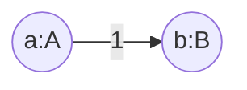
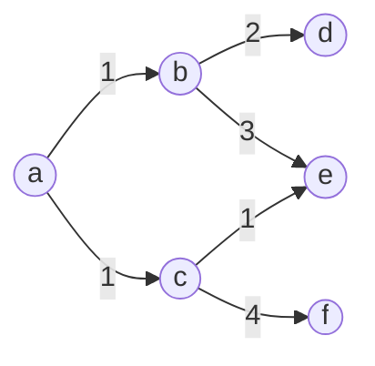
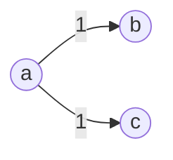
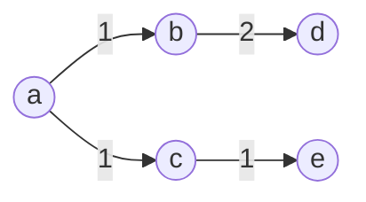
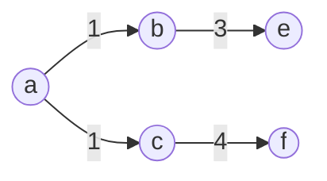

# Lantern — an in-memory graph-based key-vertex store


Lantern is a **time-decaying, in-memory graph KVS** that speaks gRPC. It behaves
like a key-value store — values are *vertices* — and lets you walk the
relationships between them in real time. Both vertices **and edges** carry
their own TTLs, so the graph naturally forgets old information the same way
real-world relationships fade.

It is not an ontology engine, not a global-shortest-path solver, and not a
disk-backed graph database. It is the small, hot, online piece you put in front
of those systems so request-path code can ask *"who is this user related to
right now, and how strongly?"* in a single millisecond-scale RPC.

---

## Why Lantern is different

Most graph stores are optimized for offline analytics on a snapshot of "what
the graph looked like yesterday." Lantern is built around three properties that
together make it well suited to **online, behavioral** workloads:

### 1. Time-decaying graph (per-edge & per-vertex TTL)

Every vertex and every edge carries an independent expiration. A background
janitor (`Watch`) compacts expired entries and drops edges whose endpoints have
disappeared. There is no manual deletion required to keep the working set warm
and small.

### 2. Additive edge weights with independent expiration

Edges are not single scalars — each `AddEdge(tail, head, w, ttl)` call appends
**another contribution** with its own TTL. The reported weight is the live sum
of contributions that have not yet expired.

```text
t=0   AddEdge(a, b, 1.0, 3s)   →  weight(a,b) = 1
t=1   AddEdge(a, b, 1.0, 3s)   →  weight(a,b) = 2   (two contributions live)
t=3   first contribution expires →  weight(a,b) = 1
t=4   second contribution expires →  weight(a,b) = 0   (edge gc'd)
```

This is the model you actually want for behavioral signals: every click, view,
or co-occurrence event simply gets appended; "how strong is this relationship
*right now*" falls out of the math, no batch job required. Use `PutEdge` when
you want classic idempotent replace instead.

### 3. Built-in online graph algorithms over the live snapshot

A single `Illuminate` RPC walks the live graph from a seed vertex and returns
a subgraph already shaped for your use case:

| Optimization | What you get | Typical use |
|---|---|---|
| _(none)_ | k-nearest neighbors per hop, up to N hops | "what is related to X" |
| `MINIMUM_SPANNING_TREE` | MST rooted at seed | clustering / dedup |
| `MAXIMUM_SPANNING_TREE` | Max-spanning tree | strongest-relationship backbone |
| `SHORTEST_PATH_TREE` | SPT using raw weights as cost | low-cost reachability |
| `SHORTEST_PATH_TREE_INVERSE` | SPT using `1/weight` as cost | **most-relevant** path tree |
| `tfidf=true` flag | Per-hop top-k weighted by `w / log2(1+df(head))` | suppress hub vertices like "popular" items |

You don't fetch a wall of edges and post-process — the server returns exactly
the shape you asked for.

---

## When to use it (and when not)

**Good fit**

- **Real-time recommenders** — user → item interaction graph with decaying
  weights; `illuminate(user, step=2, k=10, tfidf=true)` gives a candidate set
  that already discounts popular items.
- **Session-aware personalization** — short-TTL session graph layered on top
  of long-TTL preference graph in the same store.
- **Fraud / abuse co-occurrence signals** — accounts, devices, IPs as
  vertices; suspicious co-occurrences as additive edges that decay so old
  noise self-cleans.
- **Trend & "what's hot" detection** — edges from query → result tick up on
  each interaction and naturally fall off when the trend dies.
- **Short-term knowledge graph for LLM / agent context** — keep
  entity-relation cache scoped to a session TTL; query with `Illuminate` to
  build prompt context.
- **Online graph features for ML** — neighborhood aggregations served at
  request time instead of from a feature store batch.

**Not a good fit**

- Anything that needs **durability** out of the box. Lantern is in-memory only
  — a restart loses the graph. Replay your event stream into it on boot, or
  put a queue in front.
- Global graph analytics (PageRank over the whole graph, community detection
  across billions of edges, etc.).
- Massive working sets that don't fit in one process's RAM. There is no
  built-in sharding or replication today.
- Strong-consistency multi-writer scenarios. The store is a single-process
  cache with internal locking, not a distributed database.

---

## Architecture at a glance


- DI: [google/wire](https://github.com/google/wire) — see
  [server/cmd/wire.go](server/cmd/wire.go). Never edit `wire_gen.go` by hand;
  run `go generate ./...` after changing providers.
- Generic `GraphCache[S, T]` is instantiated as `GraphCache[string, *Vertex]`
  at the wire boundary (wire cannot synthesize generic type arguments).

---

## Quick start

### Run the server

```shell
docker run --rm -p 6380:6380 ghcr.io/anaregdesign/lantern:latest
```

Released images are published to `ghcr.io/anaregdesign/lantern` on every
`vX.Y.Z` git tag. **Both** tag families are available from `v0.8.0` onward:

- `vX.Y.Z` / `vX.Y` / `vX` — matches the git tag and `gh release` URL.
- `X.Y.Z` / `X.Y` / `X` — bare SemVer (the only form for `v0.5.0`–`v0.7.0`).

Plus `latest` (most recent release) and `sha-<short>` for each build.

Or build from source:

```shell
go run ./server/cmd          # listens on :6380
```

### Run on Kubernetes (HA mode)

For Tier-A HA (3 replicas with DNS-based peer discovery, anti-entropy
reconciliation, and a `PodDisruptionBudget`) install the bundled Helm
chart:

```shell
helm install lantern deploy/helm/lantern
# Or render without installing:
helm template lantern deploy/helm/lantern | less
```

The chart creates a `StatefulSet`, a headless `Service` for peer
discovery (`replication.discovery.mode=dns`), a `ClusterIP` `Service`
for clients (gRPC `:6380`), and an optional `ServiceMonitor`. See
[`deploy/helm/lantern/README.md`](deploy/helm/lantern/README.md) for
the full values reference and
[`docs/replication.md` §9.1](docs/replication.md#91-peer-discovery-190)
for the discovery semantics.

### Run with Docker Compose (HA mode)

A 3-replica HA topology for local experiments lives in
[`deploy/compose/`](deploy/compose/):

```shell
cd deploy/compose
docker compose up -d
docker compose up -d --scale lantern=5    # reconciles in ≤1 discovery tick
```

Each replica is published on its own host port (`6380`, `6381`, …) so
the Go SDK's round-robin LB (`NewLanternWithEndpoints`) can fan reads
across them, while Prometheus on `:9091` scrapes every pod via DNS SD.

### Run on serverless container PaaS

For Cloud Run / Azure Container Apps / AWS App Runner / Fly Machines /
any platform without stable pod identities, deploy a **single
instance** (or independent shards) without setting any `LANTERN_PEER_*`
env. Peer discovery requires a stable in-cluster DNS that resolves to
per-pod IPs, which these platforms do not provide. See the
[HA runbook](docs/ha-runbook.md) for the per-platform topology matrix,
signals to watch, partition behaviour, and recovery procedures.

### Use the CLI

Pre-built binaries for Linux, macOS, and Windows (amd64 + arm64) are
attached to every [GitHub Release](https://github.com/anaregdesign/lantern/releases).

```shell
# macOS (Apple Silicon) — replace VERSION with the release tag, e.g. v0.6.0
VERSION=v0.6.0
curl -L -o lantern-cli.tar.gz \
  "https://github.com/anaregdesign/lantern/releases/download/${VERSION}/lantern-cli_${VERSION#v}_Darwin_arm64.tar.gz"
tar -xzf lantern-cli.tar.gz lantern-cli
./lantern-cli version
```

Archive naming: `lantern-cli_<version>_<Linux|Darwin|Windows>_<x86_64|arm64>.tar.gz`
(`.zip` on Windows). A `checksums.txt` is published alongside the archives.

Or build from source:

```shell
go build -o lantern ./cli
./lantern --help
```

The CLI exposes every RPC as a scriptable subcommand with verbose,
LLM-friendly help text (`lantern <cmd> --help`). All read commands emit JSON
on stdout; all write commands print a single `OK` line.

```shell
# writes
./lantern vertex put alice '{"name":"Alice"}' --value-type json --ttl 1h
./lantern edge   add alice bob 1.5            # additive (sums weight)
./lantern edge   put alice bob 0.7            # idempotent (replaces)

# reads
./lantern vertex get alice                    # JSON: {key,value,expiration}
./lantern edge   get alice bob                # JSON: {tail,head,weight,expiration}
./lantern illuminate alice --step 2 --k 5 --optimize mst

# batches & streaming
./lantern vertex delete alice bob carol       # batch DeleteVertices
cat edges.ndjson | ./lantern bulk edges add - # streamed AddEdges

# prefix scan (key-space enumeration)
./lantern vertex count  users/                       # radix count for users/*
./lantern vertex scan   users/ --limit 100           # one page; next-cursor on stderr
./lantern vertex scan   users/ --all > snap.ndjson   # stream every match as NDJSON
./lantern vertex delete-prefix tmp/                  # REFUSED (safety gate)
./lantern vertex delete-prefix tmp/ --dry-run        # preview count
./lantern vertex delete-prefix tmp/ --yes            # actually delete

# edge scan (tail/head prefix; either may be empty)
./lantern edge scan --tail-prefix user: --head-prefix post:  # one page
./lantern edge scan --tail-prefix user: --all > edges.ndjson # stream every match

# TLS / mTLS
./lantern --tls --tls-ca ./ca.pem -H lantern.example.com -p 443 vertex get alice

# legacy interactive prompt
./lantern repl
```

Global flags include `--host/--port` (or `--address`), `--timeout`, `--tls*`,
`--compression {none|gzip}`, and `--chunk-size`. Exit code `0` is success,
`1` is a local / parse error, `2` is a gRPC error from the server.

### Use it from Go

The Go client SDK is its own module, so external projects pull only gRPC and
protobuf — nothing from `server/`, `cli/`, or `core/`:

```shell
go get github.com/anaregdesign/lantern/sdks/go
```

```go
import "github.com/anaregdesign/lantern/sdks/go"

cli, err := client.NewLantern("localhost:6380")
if err != nil { log.Fatal(err) }
defer cli.Close()

ctx := context.Background()

// Vertices accept string, int (signed/unsigned), float, bool, time.Time,
// time.Duration, []byte, or nil.
_ = cli.PutVertex(ctx, "user:42", "alice", 1*time.Hour)
_ = cli.PutVertex(ctx, "item:7",  "lamp",  1*time.Hour)

// Each AddEdge appends a contribution with its own TTL.
_ = cli.AddEdge(ctx, "user:42", "item:7", 1.0, 30*time.Minute)

// Walk: 2 hops, top-3 per hop, TF-IDF weighted.
g, _ := cli.Illuminate(ctx, "user:42",
    client.WithStep(2), client.WithK(3), client.WithTFIDF(true))

// Prefix scan: enumerate every vertex under a namespace, auto-paginated.
for batch, err := range cli.ScanVerticesAll(ctx, "user:", 100) {
    if err != nil { log.Fatal(err) }
    for _, v := range batch { fmt.Println(client.StringValue(v)) }
}

// Count or bulk-delete by prefix (DeleteVerticesByPrefix supports WithDryRun).
n, _ := cli.CountVerticesByPrefix(ctx, "session:abc:")
_, _ = cli.DeleteVerticesByPrefix(ctx, "session:abc:")

// Edge prefix scan: filter on tail and/or head namespace.
edges, _, _ := cli.ScanEdges(ctx,
    client.WithEdgeScanTailPrefix("user:"),
    client.WithEdgeScanHeadPrefix("post:"),
    client.WithEdgeScanLimit(100))
_ = edges
```

The full multi-type, additive-edge, and `Illuminate` example lives in
[sdks/go/example/main.go](sdks/go/example/main.go).

### Use it from another language

Generate bindings from [proto/graph/v1/graph.proto](proto/graph/v1/graph.proto)
with your favorite protoc plugin or [buf](https://buf.build). The service is
plain unary gRPC, no streaming required.

---

## gRPC surface

Defined in [proto/graph/v1/graph.proto](proto/graph/v1/graph.proto), served by
[server/service/service.go](server/service/service.go).

Every read, write, and delete operation has both a **singular** and a **plural**
form. The plural is the canonical implementation; the singular is a thin facade
that forwards a one-element batch to the plural handler. Pick whichever reads
better at the call site. `Illuminate` is the lone exception — it returns a
whole subgraph, so there is no plural form.

| RPC | Purpose | Notes |
|---|---|---|
| `GetVertex` / `GetVertices` | Fetch one or many vertices by key | Singular returns `NotFound` if expired/missing; plural reports missing keys in `Missing` and never errors on partial misses |
| `PutVertex` / `PutVertices` | Upsert vertices with TTL | Last write wins; plural is the canonical handler, singular forwards a one-element batch; SDK auto-chunks at `WithBatchChunkSize`, server enforces `LANTERN_MAX_BATCH_SIZE` |
| `DeleteVertex` / `DeleteVertices` | Remove vertices | Edges to/from them are pruned on the next GC tick (`LANTERN_GC_INTERVAL_SECONDS`, default 60s); SDK auto-chunks; idempotent (safe to retry) |
| `GetEdge` / `GetEdges` | Read current live weight(s) | Sum of unexpired contributions; plural takes `[]EdgeRef{Tail, Head}` and reports gaps in `Missing` |
| `AddEdge` / `AddEdges` | **Append** weighted contributions | Not idempotent — see *Additive edge weights* above; SDK auto-chunks; server enforces `LANTERN_MAX_BATCH_SIZE` |
| `PutEdge` / `PutEdges` | Idempotent replace (delete + add under one write lock) | Use when you want one-and-only-one weight; SDK auto-chunks; server enforces `LANTERN_MAX_BATCH_SIZE` |
| `DeleteEdge` / `DeleteEdges` | Remove edges outright | Plural takes `[]EdgeRef{Tail, Head}`; SDK auto-chunks; idempotent |
| `ScanVertices` | Enumerate vertices by key prefix, page-by-page | Opaque cursor; server enforces a default and hard cap on `limit` (see `LANTERN_SCAN_*`); cross-feeding a cursor from a different `Scan*` RPC is rejected with `InvalidArgument`; SDK helper `ScanVerticesAll` returns an `iter.Seq2` that auto-paginates |
| `CountVerticesByPrefix` | Count live vertices under a prefix | Radix-only (cheap); not subject to `limit` |
| `DeleteVerticesByPrefix` | Bulk-delete a namespace | Capped by server-configured `limit`; `dry_run` returns the count that *would* be deleted without mutating; edges incident to removed vertices are reaped on the next GC tick |
| `ScanEdges` | Enumerate edges by `tail_prefix` AND `head_prefix` | Either prefix may be empty; head dimension is served by a per-tail head radix (not a post-filter); head-only scans still iterate every tail, so combining both prefixes is the most efficient shape; same opaque-cursor / cross-RPC rejection rules as `ScanVertices`; SDK helper `ScanEdgesAll` auto-paginates |
| `Illuminate` | Walk the graph from a seed | `WithStep`, `WithK`, `WithTFIDF`, and `WithOptimization` (none / MST / max-ST / SPT / inverse-SPT); honours `ctx` cancellation; `step`/`k` are clamped at `LANTERN_ILLUMINATE_MAX_STEP` / `LANTERN_ILLUMINATE_MAX_K` |

Vertices auto-materialize on `AddEdge`/`PutEdge` if the endpoint key does not
yet exist (they get the edge's expiration as their TTL). This keeps event-stream
ingestion simple — you only need to issue edge writes.

All requests pass through a server-side validation interceptor that enforces
`LANTERN_MAX_KEY_LEN`, `LANTERN_MAX_BATCH_SIZE`, and rejects NaN/Inf weights —
oversize or malformed requests fail fast with `InvalidArgument` before touching
the cache.

In addition to the gRPC surface, every RPC carries `google.api.http` annotations
in [proto/graph/v1/graph.proto](proto/graph/v1/graph.proto) (for example
`PUT /v1/vertices/{vertex.key}`, `POST /v1/edges/{tail}/{head}/add`). These
bindings are shipped so downstream consumers can stand up a grpc-gateway in
front of Lantern; the server itself only speaks gRPC today.

---

## Configuration

The server is configured via environment variables, parsed in
[server/provider/provider.go](server/provider/provider.go):

| Variable | Default | Meaning |
|---|---|---|
| `LANTERN_PORT` | `6380` | gRPC listen port |
| `LANTERN_DEFAULT_TTL_SECONDS` | `60` | Default TTL when a request omits one |
| `LANTERN_GC_INTERVAL_SECONDS` | `60` | Cache GC tick interval |
| `LANTERN_LOG_LEVEL` | `info` | `debug` / `info` / `warn` / `error` |
| `LANTERN_LOG_FORMAT` | `json` | `json` or `text` (slog handler) |
| `LANTERN_METRICS_ADDR` | `:9090` | Address for Prometheus + health HTTP; empty disables |
| `LANTERN_REFLECTION` | `true` | Register gRPC server reflection (useful for `grpcurl`) |
| `LANTERN_SHUTDOWN_TIMEOUT_SECONDS` | `30` | Upper bound on graceful shutdown before forcing `Stop()` |
| `LANTERN_MAX_RECV_MSG_BYTES` | `16777216` | Per-RPC inbound message limit (16 MiB default) |
| `LANTERN_MAX_SEND_MSG_BYTES` | `16777216` | Per-RPC outbound message limit |
| `LANTERN_MAX_CONCURRENT_STREAMS` | `1024` | Upper bound on concurrent streams per HTTP/2 connection |
| `LANTERN_RATE_LIMIT_RPS` | `0` | Global token-bucket rate limit; `0` disables |
| `LANTERN_RATE_LIMIT_BURST` | `max(1, rps)` | Burst capacity for the rate limiter |
| `LANTERN_MAX_KEY_LEN` | `1024` | Reject vertex/edge keys longer than this (validation interceptor) |
| `LANTERN_MAX_BATCH_SIZE` | `10000` | Reject batch Put/Add requests over this size |
| `LANTERN_ILLUMINATE_MAX_STEP` | `16` | Cap on BFS depth accepted by `Illuminate` |
| `LANTERN_ILLUMINATE_MAX_K` | `1024` | Cap on neighbours-per-step accepted by `Illuminate` |
| `LANTERN_TLS_CERT_FILE` | _(unset)_ | Server certificate; enables TLS when set with key |
| `LANTERN_TLS_KEY_FILE` | _(unset)_ | Server private key |
| `LANTERN_TLS_CLIENT_CA_FILE` | _(unset)_ | Client CA bundle; enables mTLS (`RequireAndVerifyClientCert`) when set |
| `LANTERN_TOMBSTONE_TTL` | `24h` | Replication tombstone retention window. While the tombstone is live, any incoming `AddEdge`/`PutEdge`/`PutVertex` (including peer-replayed mutations via `ApplyMutation`) with an HLC strictly older than the delete is dropped, so deletes converge across nodes even under reorder. Mutations whose `Expiration` exceeds this TTL are rejected with `InvalidArgument`. Set to `0` to disable tombstones entirely (legacy behaviour; delete-then-re-add reorders may resurrect data). |

## Observability

Lantern ships production-grade observability out of the box:

- **Structured logging** via `log/slog` — JSON by default, with per-RPC
  start/finish events emitted by the
  [`grpc-ecosystem/go-grpc-middleware/v2`](https://github.com/grpc-ecosystem/go-grpc-middleware)
  logging interceptor.
- **Prometheus metrics** — gRPC server metrics (including a handling-time
  histogram) plus Go runtime and process collectors, exposed on
  `LANTERN_METRICS_ADDR` at `/metrics`. Lantern also publishes its own
  domain collectors so you can chart cache load and GC pressure directly:

  | Metric | Type | Labels | Description |
  |---|---|---|---|
  | `lantern_vertices` | gauge | — | Live vertex count in the in-memory cache. |
  | `lantern_edges` | gauge | — | Live edge count in the in-memory cache. |
  | `lantern_ttl_expirations_total` | counter | `kind` (`vertex`, `edge`, `dangling_edge`) | Entries reaped per GC tick, partitioned by kind. |
  | `lantern_gc_duration_seconds` | histogram | — | Wall-clock duration of a single GC tick (buckets `0.1ms..~1.6s`). |
  | `lantern_build_info` | gauge (=1) | `version`, `commit`, `go_version` | Build metadata for the running server. |
- **Health checks** — gRPC standard health service (`grpc.health.v1.Health`)
  *and* HTTP `/healthz` + `/readyz` on the metrics listener, so both
  Kubernetes probes and `grpc_health_probe` work.
- **Distributed tracing** — OpenTelemetry server instrumentation via
  `otelgrpc.NewServerHandler()` (modern stats-handler API; the deprecated
  unary/stream interceptors are not used). Set `OTEL_EXPORTER_OTLP_ENDPOINT`
  (or `OTEL_EXPORTER_OTLP_TRACES_ENDPOINT`) to install an OTLP exporter and
  start shipping spans; without it the global tracer provider stays at noop
  so there is zero export overhead. `OTEL_EXPORTER_OTLP_PROTOCOL` selects
  `grpc` (default) or `http/protobuf`, and all standard OTel SDK env vars
  (`OTEL_EXPORTER_OTLP_HEADERS`, `OTEL_EXPORTER_OTLP_INSECURE`,
  `OTEL_EXPORTER_OTLP_TIMEOUT`, …) are honoured. The tracer provider is
  flushed on graceful shutdown.
- **gRPC reflection** — registered by default; turn off with
  `LANTERN_REFLECTION=false` for hardened deployments.
- **Keepalive + panic recovery** — sensible `keepalive.ServerParameters` and
  an enforcement policy are applied, and a recovery interceptor turns panics
  into `Internal` status responses with a logged stack trace instead of
  crashing the process.

---

## Repository layout

This is a monorepo consolidating four formerly separate repositories, now stitched together as a 5-module Go workspace so each piece can be consumed independently.

| Path | Module | Role |
|---|---|---|
| `pb/` | `github.com/anaregdesign/lantern/pb` | Generated protobuf / gRPC / grpc-gateway stubs. Shared contract — both `server/` and `sdks/go/` depend on it. |
| `core/` | `github.com/anaregdesign/lantern/core` | Shared building blocks: graph algorithms, TTL caches, collections, concurrency, NLP. |
| `sdks/go/` | `github.com/anaregdesign/lantern/sdks/go` | Go client SDK — depends on `pb/` only. |
| `server/` | `github.com/anaregdesign/lantern/server` | gRPC server (DI via google/wire) — depends on `pb/` + `core/`, **not** on the client SDK. |
| `.` (root) | `github.com/anaregdesign/lantern` | Umbrella module hosting `cli/` (cobra + promptui) and `tests/integration/` (cross-module bufconn tests). |
| `proto/` | (no Go module) | `.proto` sources — formerly `lantern-proto`. |
| `go.work` | — | Pins all 5 modules for local dev. |

Dependency direction is a strict DAG: `pb` and `core` are leaves; `sdks/go` → `pb`; `server` → `pb`, `core`; root → all four.

---

## Developing on Lantern

```shell
make build       # go build -v ./...
make test        # go test -v ./...
make test-race   # go test -race -shuffle=on -covermode=atomic ./...
make fmt         # gofmt -s -w .
make vet         # go vet ./...
make generate    # go generate ./...  (runs wire + buf — no install required)
make wire        # alias: go tool wire ./server/cmd
make proto       # alias: buf generate --clean (uses system `buf` if present, else `go run`)
make vuln        # govulncheck ./...
make tidy        # go mod tidy
```

Codegen is one command:

```shell
go generate ./...
```

This regenerates both `server/cmd/wire_gen.go` and everything under `pb/`.
No CLIs need to be installed up front:

- **wire** is wired in via the `tool` directive in `go.mod` — `go tool wire`
  just works after `go mod download`.
- **buf** is invoked via `go run github.com/bufbuild/buf/cmd/buf@v1.70.0` when
  no system `buf` is on `PATH`. Installing `buf` locally only makes the first
  invocation faster; correctness is identical.

Required toolchain:

- **Go 1.26** — kept in lockstep across `go.mod`, the Dockerfile
  (`golang:1.26-alpine`), and `.github/workflows/go.yml`. Bumping the version
  means bumping all three.

### Conventions and gotchas

- **High availability / replication** — Lantern's leaderless full-replica
  design (HLC, mutation log, Subscribe/Snapshot, tombstones, deployment
  topology matrix) is specified in [docs/replication.md](docs/replication.md).
  Operator-facing playbook (signals, partition recovery, upgrades,
  per-platform deploy) is in [docs/ha-runbook.md](docs/ha-runbook.md).
  All HA-tagged issues implement against that RFC.
- **Never hand-edit `server/cmd/wire_gen.go`** — it is generated. Edit providers
  in [server/provider/provider.go](server/provider/provider.go) or definitions
  in [server/cmd/wire.go](server/cmd/wire.go), then re-run `go generate ./...`
  (or `make wire` for just the wire step).
- **wire + generics** — wire cannot synthesize generic type arguments, so the
  provider returns the concrete `*graph.GraphCache[string, *Vertex]`. Re-check
  this constraint before introducing generics there.
- **Adding a new vertex value type** in the Go SDK requires updating *three*
  call sites in [sdks/go/value.go](sdks/go/value.go): `nativeVertex.asVertex`
  (Go → proto), the matching `*Value(v)` free function plus its `VertexKind*`
  constant and `Kind` switch entry (proto → Go), and the `MarshalVertexJSON`
  switch (proto → JSON). Accessors are package-level functions, not methods —
  `client.Vertex` is a true alias of `pb.Vertex`.
- **Proto `go_package`** is `github.com/anaregdesign/lantern/pb/graph/v1`.
  `make proto` rewrites everything under `pb/`.
- **Not every `*Response` message has a `Status` field** — check
  [`pb/graph/v1/graph.pb.go`](pb/graph/v1/graph.pb.go) before patching
  response types.
- **Test coverage** — `server/service/service_test.go` exercises the gRPC
  surface (vertex/edge CRUD, singular-write facades, `Illuminate`
  optimizations, context cancellation); `sdks/go/` has unit tests for value
  conversion and the client wrapper; `tests/integration/` wires the real
  server over bufconn to cover SDK-as-consumer paths. The remaining gap is
  end-to-end wire wiring (`server/cmd`). Add at least a minimal table test in
  the same PR for non-trivial changes.

### CI / release

- [`.github/workflows/go.yml`](.github/workflows/go.yml) runs `go build` + `go
  test` on every PR/push (Go 1.26).
- [`.github/workflows/docker-publish.yml`](.github/workflows/docker-publish.yml)
  publishes to `ghcr.io/anaregdesign/lantern` on `v*.*.*` tag pushes and signs
  the image with cosign (keyless, `--yes`).

---

## CLI cheatsheet

These commands are accepted by the interactive REPL (`./lantern repl`). The
cobra subcommands (`./lantern vertex put …`, `./lantern edge add …`, etc.)
shown earlier accept the same arguments.

```shell
put vertex <key:string> <value:string> [<ttl:int>]
put edge   <tail:string> <head:string> <weight:float> [<ttl:int>]
add edge   <tail:string> <head:string> <weight:float> [<ttl:int>]
get vertex <key:string>
get edge   <tail:string> <head:string>
delete vertex <key:string>
delete edge   <tail:string> <head:string>
illuminate <neighbor|spt_cost|spt_relevance|mst_cost|mst_relevance> \
           <seed:string> <step:int> <k:int> <tfidf:bool>
```

Worked examples (with diagrams) live in the walkthrough below.

### CLI walkthrough

#### Put a couple of vertices and an edge

The two `put vertex` and one `put edge` commands below build this tiny graph:



```shell
> put vertex a A
OK (454.695µs)
> put vertex b B
OK (768.012µs)
> put edge a b 1
OK (642.748µs)
> get vertex a
{"String_":"A"}
> get edge a b
1.000000
```

#### Explore neighborhoods with `illuminate`

After loading a richer graph — `a` connects out to `b`, `c`; `b` and `c` fan
out further, with mixed weights so the tree examples below have something
to choose between:



`illuminate neighbor a 1 2 false` returns just the 1-hop neighborhood of
seed `a` (top-`k=2` edges per vertex, no TF-IDF reweighting):

```shell
> illuminate neighbor a 1 2 false
{
  "vertices": { ... },
  "edges": { "a": { "b": 1, "c": 1 } }
}
```



#### Shortest-path tree by cost vs. relevance

```shell
> illuminate spt_cost a 2 2 false        # uses raw weight as cost
> illuminate spt_relevance a 2 2 false   # uses 1/weight as cost
```

`spt_cost` treats edge weight directly as cost — lighter edges are
preferred, so the tree reaches `e` via `c` (cost `1+1=2`) rather than via
`b` (cost `1+3=4`):



`spt_relevance` inverts the weight (cost = `1/weight`), so heavier edges
become cheaper — relevance-weighted traversal picks the `c → f`
(weight `4`, cost `0.25`) and `b → e` (weight `3`, cost `0.33`) branches
instead:



---

## Roadmap & limitations

- **Single-process, in-memory only.** Multi-node sharding and replication are
  not built in. Production deployments typically replay events from a durable
  log (Kafka, etc.) into Lantern on boot.
- **No authn / authz built in.** TLS and mTLS *are* supported out of the
  box via the `LANTERN_TLS_*` env vars (and the matching `--tls*` client
  flags), but per-RPC authentication is not — front it with a service mesh
  or envoy-style sidecar if you need identity-based access control.
- **Single global `sync.RWMutex` on the graph cache** plus per-edge mutexes on
  weight aggregation. Read-heavy workloads scale well; write-very-hot keys
  serialize.

PRs and issue discussion welcome.

---

## License

See [LICENSE](LICENSE).
