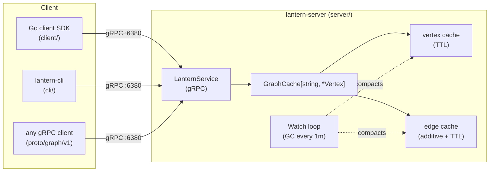

# Lantern — an in-memory graph-based key-vertex store


Lantern is a **time-decaying, in-memory graph KVS** that speaks gRPC. It behaves
like a key-value store — values are *vertices* — and lets you walk the
relationships between them in real time. Both vertices **and edges** carry
their own TTLs, so the graph naturally forgets old information the same way
real-world relationships fade.

It is not an ontology engine, not a global-shortest-path solver, and not a
disk-backed graph database. It is the small, hot, online piece you put in front
of those systems so request-path code can ask *"who is this user related to
right now, and how strongly?"* in a single millisecond-scale RPC.

---

## Why Lantern is different

Most graph stores are optimized for offline analytics on a snapshot of "what
the graph looked like yesterday." Lantern is built around three properties that
together make it well suited to **online, behavioral** workloads:

### 1. Time-decaying graph (per-edge & per-vertex TTL)

Every vertex and every edge carries an independent expiration. A background
janitor (`Watch`) compacts expired entries and drops edges whose endpoints have
disappeared. There is no manual deletion required to keep the working set warm
and small.

### 2. Additive edge weights with independent expiration

Edges are not single scalars — each `AddEdge(tail, head, w, ttl)` call appends
**another contribution** with its own TTL. The reported weight is the live sum
of contributions that have not yet expired.

```text
t=0   AddEdge(a, b, 1.0, 3s)   →  weight(a,b) = 1
t=1   AddEdge(a, b, 1.0, 3s)   →  weight(a,b) = 2   (two contributions live)
t=3   first contribution expires →  weight(a,b) = 1
t=4   second contribution expires →  weight(a,b) = 0   (edge gc'd)
```

This is the model you actually want for behavioral signals: every click, view,
or co-occurrence event simply gets appended; "how strong is this relationship
*right now*" falls out of the math, no batch job required. Use `PutEdge` when
you want classic idempotent replace instead.

### 3. Built-in online graph algorithms over the live snapshot

A single `Illuminate` RPC walks the live graph from a seed vertex and returns
a subgraph already shaped for your use case:

| Optimization | What you get | Typical use |
|---|---|---|
| _(none)_ | k-nearest neighbors per hop, up to N hops | "what is related to X" |
| `MINIMUM_SPANNING_TREE` | MST rooted at seed | clustering / dedup |
| `MAXIMUM_SPANNING_TREE` | Max-spanning tree | strongest-relationship backbone |
| `SHORTEST_PATH_TREE` | SPT using raw weights as cost | low-cost reachability |
| `SHORTEST_PATH_TREE_INVERSE` | SPT using `1/weight` as cost | **most-relevant** path tree |
| `tfidf=true` flag | Per-hop top-k weighted by `w / log2(1+df(head))` | suppress hub vertices like "popular" items |

You don't fetch a wall of edges and post-process — the server returns exactly
the shape you asked for.

---

## When to use it (and when not)

**Good fit**

- **Real-time recommenders** — user → item interaction graph with decaying
  weights; `illuminate(user, step=2, k=10, tfidf=true)` gives a candidate set
  that already discounts popular items.
- **Session-aware personalization** — short-TTL session graph layered on top
  of long-TTL preference graph in the same store.
- **Fraud / abuse co-occurrence signals** — accounts, devices, IPs as
  vertices; suspicious co-occurrences as additive edges that decay so old
  noise self-cleans.
- **Trend & "what's hot" detection** — edges from query → result tick up on
  each interaction and naturally fall off when the trend dies.
- **Short-term knowledge graph for LLM / agent context** — keep
  entity-relation cache scoped to a session TTL; query with `Illuminate` to
  build prompt context.
- **Online graph features for ML** — neighborhood aggregations served at
  request time instead of from a feature store batch.

**Not a good fit**

- Anything that needs **durability** out of the box. Lantern is in-memory only
  — a restart loses the graph. Replay your event stream into it on boot, or
  put a queue in front.
- Global graph analytics (PageRank over the whole graph, community detection
  across billions of edges, etc.).
- Massive working sets that don't fit in one process's RAM. There is no
  built-in sharding or replication today.
- Strong-consistency multi-writer scenarios. The store is a single-process
  cache with internal locking, not a distributed database.

---

## Architecture at a glance



- DI: [google/wire](https://github.com/google/wire) — see
  [server/cmd/wire.go](server/cmd/wire.go). Never edit `wire_gen.go` by hand;
  run `go generate ./...` after changing providers.
- Generic `GraphCache[S, T]` is instantiated as `GraphCache[string, *Vertex]`
  at the wire boundary (wire cannot synthesize generic type arguments).

---

## Quick start

### Run the server

```shell
docker run --rm -p 6380:6380 ghcr.io/anaregdesign/lantern:latest
```

Or build from source:

```shell
go run ./server/cmd          # listens on :6380
```

### Use the CLI

```shell
go build -o lantern-cli ./cli
./lantern-cli --host localhost --port 6380
```

### Use it from Go

```go
import "github.com/anaregdesign/lantern/client"

cli, err := client.NewLantern("localhost", 6380)
if err != nil { log.Fatal(err) }
defer cli.Close()

ctx := context.Background()

// Vertices accept string, int, float, bool, time.Time, []byte, or nil.
_ = cli.PutVertex(ctx, "user:42", "alice", 1*time.Hour)
_ = cli.PutVertex(ctx, "item:7",  "lamp",  1*time.Hour)

// Each AddEdge appends a contribution with its own TTL.
_ = cli.AddEdge(ctx, "user:42", "item:7", 1.0, 30*time.Minute)

// Walk: 2 hops, top-3 per hop, TF-IDF weighted.
g, _ := cli.Illuminate(ctx, "user:42", 2, 3, true)
```

The full multi-type, additive-edge, and `Illuminate` example lives in
[client/example/main.go](client/example/main.go).

### Use it from another language

Generate bindings from [proto/graph/v1/graph.proto](proto/graph/v1/graph.proto)
with your favorite protoc plugin or [buf](https://buf.build). The service is
plain unary gRPC, no streaming required.

---

## gRPC surface

Defined in [proto/graph/v1/graph.proto](proto/graph/v1/graph.proto), served by
[server/service/service.go](server/service/service.go).

| RPC | Purpose | Notes |
|---|---|---|
| `PutVertex` | Upsert one or more vertices with TTL | Last write wins |
| `GetVertex` | Fetch a vertex by key | `NotFound` if expired/missing |
| `DeleteVertex` | Remove a vertex | Edges to/from it are GC'd on next `Watch` tick |
| `AddEdge` | **Append** a weighted contribution | Not idempotent — see §1.2 above |
| `PutEdge` | Idempotent replace (delete + add) | Use when you want one-and-only-one weight |
| `GetEdge` | Read current live weight | Sum of unexpired contributions |
| `DeleteEdge` | Remove an edge outright | |
| `Illuminate` | Walk the graph from a seed | `step`, `k`, `tfidf`, and `Optimization` (none / MST / max-ST / SPT / inverse-SPT) |

Vertices auto-materialize on `AddEdge`/`PutEdge` if the endpoint key does not
yet exist (they get the edge's expiration as their TTL). This keeps event-stream
ingestion simple — you only need to issue edge writes.

---

## Configuration

The server is configured via environment variables, parsed in
[server/provider/provider.go](server/provider/provider.go):

| Variable | Default | Meaning |
|---|---|---|
| `LANTERN_PORT` | `6380` | gRPC listen port |
| `LANTERN_DEFAULT_TTL_SECONDS` | `60` | Default TTL when a request omits one |
| `LANTERN_GC_INTERVAL_SECONDS` | `60` | Cache GC tick interval |
| `LANTERN_LOG_LEVEL` | `info` | `debug` / `info` / `warn` / `error` |
| `LANTERN_LOG_FORMAT` | `json` | `json` or `text` (slog handler) |
| `LANTERN_METRICS_ADDR` | `:9090` | Address for Prometheus + health HTTP; empty disables |
| `LANTERN_REFLECTION` | `true` | Register gRPC server reflection (useful for `grpcurl`) |

## Observability

Lantern ships production-grade observability out of the box:

- **Structured logging** via `log/slog` — JSON by default, with per-RPC
  start/finish events emitted by the
  [`grpc-ecosystem/go-grpc-middleware/v2`](https://github.com/grpc-ecosystem/go-grpc-middleware)
  logging interceptor.
- **Prometheus metrics** — gRPC server metrics (including a handling-time
  histogram) plus Go runtime and process collectors, exposed on
  `LANTERN_METRICS_ADDR` at `/metrics`.
- **Health checks** — gRPC standard health service (`grpc.health.v1.Health`)
  *and* HTTP `/healthz` + `/readyz` on the metrics listener, so both
  Kubernetes probes and `grpc_health_probe` work.
- **Distributed tracing** — OpenTelemetry server instrumentation via
  `otelgrpc.NewServerHandler()` (modern stats-handler API; the deprecated
  unary/stream interceptors are not used). Wire up an exporter via the standard
  `OTEL_EXPORTER_OTLP_*` env vars to ship traces.
- **gRPC reflection** — registered by default; turn off with
  `LANTERN_REFLECTION=false` for hardened deployments.
- **Keepalive + panic recovery** — sensible `keepalive.ServerParameters` and
  an enforcement policy are applied, and a recovery interceptor turns panics
  into `Internal` status responses with a logged stack trace instead of
  crashing the process.

---

## Repository layout

This is a monorepo consolidating four formerly separate repositories.

| Path | Role |
|---|---|
| `server/` | gRPC server (DI via google/wire) |
| `client/` | Go client SDK |
| `cli/` | Interactive CLI (`cobra` + `promptui`) — formerly `lantern-cli` |
| `proto/` | `.proto` sources — formerly `lantern-proto` |
| `gen/go/` | Generated Go bindings (regenerate with `go generate ./...`) |
| `core/` | Shared building blocks reused by server & client: graph algorithms, TTL caches, collections, concurrency, NLP |

---

## Developing on Lantern

```shell
make build       # go build -v ./...
make test        # go test -v ./...
make test-race   # go test -race -shuffle=on -covermode=atomic ./...
make fmt         # gofmt -s -w .
make vet         # go vet ./...
make generate    # go generate ./...  (runs wire + buf — no install required)
make wire        # alias: go tool wire ./server/cmd
make proto       # alias: buf generate --clean (uses system `buf` if present, else `go run`)
make vuln        # govulncheck ./...
make tidy        # go mod tidy
```

Codegen is one command:

```shell
go generate ./...
```

This regenerates both `server/cmd/wire_gen.go` and everything under `gen/go/`.
No CLIs need to be installed up front:

- **wire** is wired in via the `tool` directive in `go.mod` — `go tool wire`
  just works after `go mod download`.
- **buf** is invoked via `go run github.com/bufbuild/buf/cmd/buf@v1.70.0` when
  no system `buf` is on `PATH`. Installing `buf` locally only makes the first
  invocation faster; correctness is identical.

Required toolchain:

- **Go 1.26** — kept in lockstep across `go.mod`, the Dockerfile
  (`golang:1.26-alpine`), and `.github/workflows/go.yml`. Bumping the version
  means bumping all three.

### Conventions and gotchas

- **Never hand-edit `server/cmd/wire_gen.go`** — it is generated. Edit providers
  in [server/provider/provider.go](server/provider/provider.go) or definitions
  in [server/cmd/wire.go](server/cmd/wire.go), then re-run `go generate ./...`
  (or `make wire` for just the wire step).
- **wire + generics** — wire cannot synthesize generic type arguments, so the
  provider returns the concrete `*graph.GraphCache[string, *Vertex]`. Re-check
  this constraint before introducing generics there.
- **Adding a new vertex value type** in the Go SDK requires updating *both*
  directions in [client/value.go](client/value.go): `nativeVertex.asVertex()`
  (Go → proto) and the matching `*Value()` accessor (proto → Go).
- **Proto `go_package`** is `github.com/anaregdesign/lantern/gen/go/graph/v1`.
  `make proto` rewrites everything under `gen/go`.
- **Not every `*Response` message has a `Status` field** — check
  [`gen/go/graph/v1/graph.pb.go`](gen/go/graph/v1/graph.pb.go) before patching
  response types.
- **Test gaps** — there are currently no tests for the server/service layer,
  wire wiring, or client transport paths. Add at least minimal table tests in
  the same PR for non-trivial changes there.

### CI / release

- [`.github/workflows/go.yml`](.github/workflows/go.yml) runs `go build` + `go
  test` on every PR/push (Go 1.26).
- [`.github/workflows/docker-publish.yml`](.github/workflows/docker-publish.yml)
  publishes to `ghcr.io/anaregdesign/lantern` on `v*.*.*` tag pushes and signs
  the image with cosign (keyless, `--yes`).

---

## CLI cheatsheet

```shell
put vertex <key:string> <value:string> [<ttl:int>]
put edge   <tail:string> <head:string> <weight:float> [<ttl:int>]
get vertex <key:string>
get edge   <tail:string> <head:string>
illuminate <neighbor|spt_cost|spt_relevance|mst_cost|mst_relevance> \
           <seed:string> <step:int> <k:int> <tfidf:bool>
```

Worked examples (with diagrams) live in [docs/cli-examples.md](#cli-walkthrough)
below.

### CLI walkthrough

#### Put a couple of vertices and an edge


```shell
> put vertex a A
OK (454.695µs)
> put vertex b B
OK (768.012µs)
> put edge a b 1
OK (642.748µs)
> get vertex a
{"String_":"A"}
> get edge a b
1.000000
```

#### Explore neighborhoods with `illuminate`

After loading a richer graph:


```shell
> illuminate neighbor a 1 2 false
{
  "vertices": { ... },
  "edges": { "a": { "b": 1, "c": 1 } }
}
```


#### Shortest-path tree by cost vs. relevance

```shell
> illuminate spt_cost a 2 2 false        # uses raw weight as cost
> illuminate spt_relevance a 2 2 false   # uses 1/weight as cost
```


---

## Roadmap & limitations

- **Single-process, in-memory only.** Multi-node sharding and replication are
  not built in. Production deployments typically replay events from a durable
  log (Kafka, etc.) into Lantern on boot.
- **No auth / TLS in the default build.** Front it with a service mesh or
  envoy-style sidecar for production exposure.
- **Single global `sync.RWMutex` on the graph cache** plus per-edge mutexes on
  weight aggregation. Read-heavy workloads scale well; write-very-hot keys
  serialize.

PRs and issue discussion welcome.

---

## License

See [LICENSE](LICENSE).
