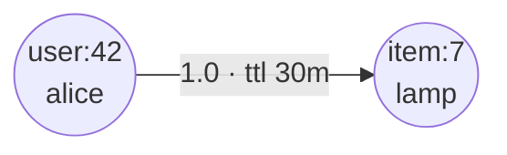
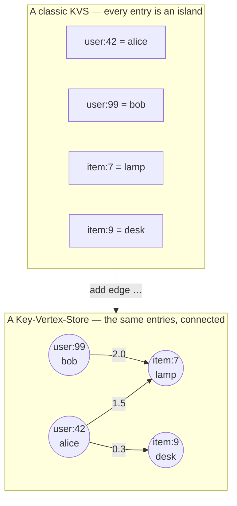
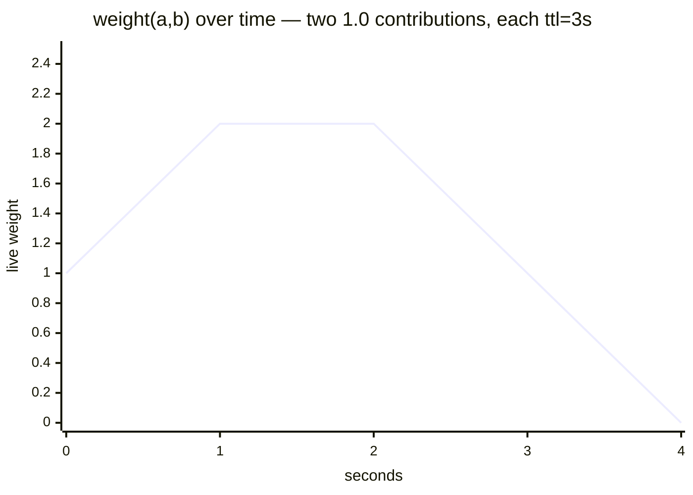
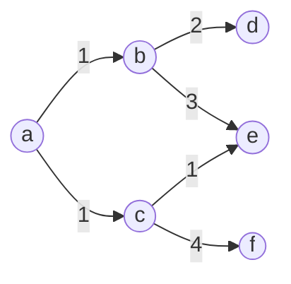
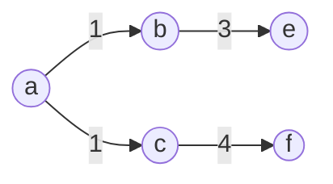
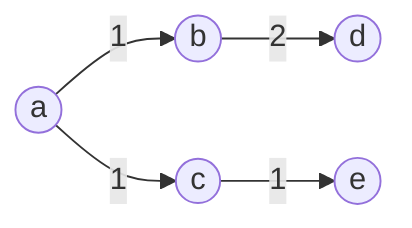
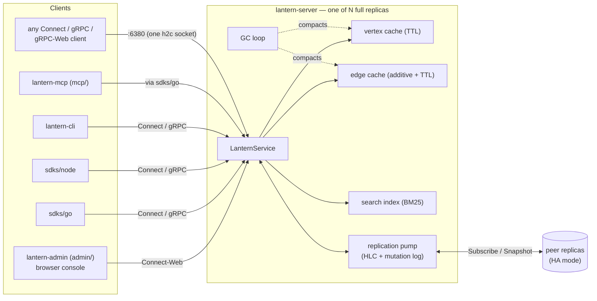

# Lantern — the in-memory Key-Vertex-Store


[](https://github.com/anaregdesign/lantern/actions/workflows/go.yml)
[](https://github.com/anaregdesign/lantern/releases)
[](https://pkg.go.dev/github.com/anaregdesign/lantern/sdks/go)
[](https://www.npmjs.com/package/lantern-sdk)
[](LICENSE)

**Lantern is a cache that understands relationships.** It is a
**Key-Vertex-Store**: you use it like the key-value cache you already run —
`put`, `get`, TTL — but every value is a *vertex*, and weighted, decaying
*edges* connect them. So alongside "get me this value", your request-path
code can ask, in a single millisecond-scale RPC:

- *"What's near this key right now?"* — `bfs`, `pagerank`, and `community`
  walk the live graph and return a subgraph already shaped for your use case
  (k-NN, spanning tree, shortest paths, PageRank, community).
- *"How strongly are these two related at this moment?"* — edge weights are
  live sums of TTL'd contributions, so relationship strength decays on its
  own as events age out.
- *"Which keys match these words?"* — BM25 full-text search over vertex
  content, with fuzzy/phrase/prefix matching, built into the same store.

No nightly graph pipeline, no heavyweight graph database on the hot path, no
fetching a wall of edges to post-process in your service. The graph lives
where cache data lives: in memory, with TTLs, in front of your system of
record.

```text
> put vertex user:42 "alice"
> put vertex item:7  "lamp"
> add edge user:42 item:7 1.0 1800     # each event appends a decaying contribution
> bfs user:42 2 10                     # 2 hops out, top-10 per hop — one RPC
{ "vertices": { ... }, "edges": { ... } }
```

Those three writes just built a live graph:



Everything speaks the [Connect protocol](https://connectrpc.com/) — with
gRPC and gRPC-Web wire compatibility on the same h2c socket — so Go
services, browsers, CLIs, and anything with a protobuf toolchain hit the
identical API on one port.

> **Status: pre-1.0 — expect breaking changes.** Until `v1.0.0`, Lantern makes no
> backward-compatibility guarantees: the proto/wire schema, SDK APIs, CLI grammar,
> `LANTERN_*` env vars, and metric names can change between releases. Pin a version
> if you need stability.

---

## Why a graph in your cache?

Most graph stores are built for offline analytics over yesterday's snapshot.
Most caches flatten relationships away entirely. Lantern sits in the gap:
**online, behavioral graph data with cache semantics.**

### Never used a graph? It's just entries + connections

A key-value cache stores isolated entries. Lantern turns those entries into
a **graph in the mathematical sense** — the weighted directed graph of
graph theory, *G = (V, E, w)*: vertices, directed edges between them, a
real-valued weight on each edge, and (Lantern's cache-native twist) a TTL
on all of it. Not the *property graph* of graph databases, with typed,
attribute-laden edges — the plain mathematical object. Same data, one new
dimension:



That's the entire vocabulary you need:

- **Vertex** — one cache entry: a key and its value (`user:42 = alice`), with a TTL.
- **Edge** — an ordered pair of keys with a weight and a TTL: one element
  of *E*, nothing more — no type, label, or property bag. If you need
  relationship kinds ("clicked" vs "bought"), encode them in your key
  design or weight conventions.
- **Weight** — how strong that link is right now. In Lantern it's the live
  sum of decaying contributions, so recent events count more than old ones.
- **TTL** — everything above expires on its own; nothing needs a cleanup job.

Staying with the mathematical object is deliberate — it is what keeps the
rest of Lantern simple and fast:

- **The classic algorithms apply directly.** Spanning trees, shortest
  paths, PageRank, community detection — graph theory defines them on
  exactly this object, a weighted directed graph. The traversal RPC runs
  them natively over every edge, with no "which relationship types does
  this walk follow?" configuration and no schema the server has to know
  about; a property graph has to be flattened down to weights before any
  of that theory applies.
- **Every event can pile onto the same edge.** The additive, decaying
  weight model works because merging contributions is just addition —
  there are no per-type aggregation rules to define.
- **Nothing to design up front, nothing to migrate.** A new kind of event
  starts flowing into the graph the moment you write it — cache semantics
  extend to the data model itself.
- **Edges stay tiny.** A contribution is a weight and an expiration, which
  is why a large working set fits in one process's memory in the first
  place.

The payoff: questions like *"what has this user interacted with lately, and
how strongly?"* stop being JOINs over event logs in your warehouse and
become a one-RPC lookup against the cache.

### TTLs on everything — including edges

Every vertex *and every edge* can carry its own expiration. A background
janitor compacts expired entries and prunes edges whose endpoints vanished.
The working set stays warm and small without manual deletes: the graph
forgets old information the same way real-world relationships fade.

### Edge weights that accumulate — and decay

Edges are not single scalars. Each `add edge` appends **another
contribution** with its own TTL; the reported weight is the live sum of
contributions that have not yet expired:

```text
t=0   add edge a b 1.0 ttl=3s    →  weight(a,b) = 1
t=1   add edge a b 1.0 ttl=3s    →  weight(a,b) = 2   (two contributions live)
t=3   first contribution expires →  weight(a,b) = 1
t=4   second expires             →  weight(a,b) = 0   (edge gc'd)
```



This is the model behavioral signals actually want: every click, view, or
co-occurrence is one append, and *"how strong is this relationship right
now"* falls out of the math — no batch job. Need classic idempotent
replace instead? That's `put edge`.

**Want a smooth geometric decay instead of a flat TTL cliff?** The Go SDK's
`AddDecayingEdge` is a client-side helper (no extra RPC — the server stays a
dumb additive store) that expands one
`DecayOpts{InitialWeight, Ratio, Steps, Interval}` into a handful of
staggered-TTL contributions and ships them as a single `AddEdges` batch, so
the live weight steps down geometrically (e.g. `16 → 8 → 4 → 2 → 1 → 0`)
rather than disappearing all at once. The contributions telescope, so they
sum to `InitialWeight` (writing `{8,4,2,1,1}`, not `{16,8,4,2,1}`). CLI:
`add decaying-edge <tail> <head> <initial_weight> <ratio> <steps> <interval_seconds>`.

Vertices also auto-materialize on edge writes (inheriting the edge's TTL),
so ingesting an event stream is just a stream of edge writes.

### Graph queries as single RPCs

One `Illuminate` RPC walks the live graph from a seed and returns exactly
the shape you asked for. The CLI exposes that RPC as three family verbs —
`bfs`, `pagerank`, and `community` — with orthogonal knobs for tree rendering,
optimization direction, and weighting:

Every request selects one family explicitly. SDK calls use `WithBFS`,
`WithPPR`, or `WithLocalCommunity` (or the matching Node options arm); raw
requests with no `params` arm are rejected. BFS also requires positive `step`
and `fan_out` — unlike PageRank `top_n=0` and community `max_size=0`, zero is
not a default sentinel for BFS.

| Axis | Options | What it picks |
|---|---|---|
| family verb | `bfs` / `pagerank` / `community` | Greedy per-hop top-k neighbourhood, Personalized PageRank relevance star, or the seed's natural community (conductance-cut, returned as a real induced subgraph) |
| `reduction` | `none` (default) / `mst` / `spt` | Return the raw family result, or render the `bfs` / `community` result as a rooted directed arborescence (`mst`) or shortest-path tree (`spt`) |
| `objective` | `max` (default) / `min` | Keep strongest edges vs cheapest edges — the direction of both the `bfs` per-hop top-k prune and any tree reduction (ignored by `pagerank`, which ranks by mass) |
| `weighting` | `raw` (default) / `tfidf` / `bm25` | Edge-weight transform applied before the walk — TF-IDF and BM25 damp hub vertices like "popular" items |

Seeing is believing. Say the store holds this graph (labels are weights):



`bfs a 2 2 reduction=spt objective=max` treats heavy edges as cheap
(cost = 1/weight), so one RPC hands back the **strongest-relationship
tree** — no client-side post-processing:



Flip to `objective=min` and weights become costs: the same RPC now returns
the **cheapest-path tree**, reaching `e` via `c` (cost 1+1) instead of via
`b` (cost 1+3):



A few more combinations and what they buy you:

```text
bfs user:42 2 10                                      # raw 2-hop neighbourhood
bfs user:42 3 8 reduction=spt objective=max           # most-relevant path tree
bfs user:42 3 8 reduction=mst objective=min           # clustering / dedup backbone
pagerank user:42 10                                   # PageRank-ranked neighbourhood
community user:42 30                                  # the seed's natural community
community user:42 30 reduction=mst objective=min      # …as a spanning-tree backbone
bfs user:42 2 10 weighting=tfidf                      # suppress hub items
```

The family verb picks the traversal (`bfs`, `pagerank`, `community`) and the
orthogonal `reduction` axis (`none` default, `mst`, `spt`) renders the
`bfs`/`community` result as a tree rooted at the seed — so a local community
can be handed back as its own minimum/maximum rooted directed arborescence in
one RPC. `mst` optimises over the actual directed edges: every reachable
non-seed vertex has one incoming tree edge, rather than applying undirected
Prim semantics to asymmetric relationships.
`reduction` is not accepted by `pagerank`, which returns a ranked star.

PPR takes two locality knobs (`restart_prob`, `epsilon` — higher restart
keeps the walk closer to the seed; smaller epsilon pushes further for more
recall). A `prefix=` filter restricts the walk to a key namespace *during*
traversal, yielding the prefix-induced subgraph — note that with `mst`/`spt`
a matching vertex reachable only through a non-matching bridge is excluded,
because the bridge is not traversable.

### Full-text search over the same store

`SearchVertices` runs relevance-ranked (BM25) full-text search over vertex
*content* — key plus value — as the content-addressed counterpart to prefix
scans. Ranked hits make natural seeds for a follow-up `bfs`, `pagerank`, or
`community` walk:

```shell
lantern-cli search "rolling update"              # OR-union of the query words
lantern-cli search "rolling update" --mode all   # require every word (AND)
lantern-cli search "rolling update" --phrase     # adjacent, in order
lantern-cli search serach --fuzziness 1          # typos still hit
lantern-cli search lan --prefix-terms            # "lan" finds "lantern"
lantern-cli search espresso --prefix user.       # scope to a key namespace
```

The index is maintained server-side and is on by default
(`LANTERN_SEARCH_ENABLED`).

---

## Try it in 60 seconds

Start a server (Docker, Homebrew, or source):

```shell
docker run --rm -p 6380:6380 ghcr.io/anaregdesign/lantern:latest

# or on macOS:
brew tap anaregdesign/tap
brew install --cask lantern        # server (binary: lantern)
brew install --cask lantern-cli    # client (binary: lantern-cli)

# or from source:
go run ./server/cmd                # listens on :6380
```

Then poke at it with the CLI — `lantern-cli repl` for an interactive prompt,
or the same grammar as verb-first one-liners:

```text
$ lantern-cli repl
> put vertex alice Alice
OK (1.2ms)
> put vertex bob Bob 3600               # third arg = TTL seconds
OK (0.9ms)
> add edge alice bob 1.5 3600           # additive: appends a contribution
OK (1.1ms)
> add edge alice bob 0.5 3600           # second contribution
OK (0.8ms)
> get edge alice bob                    # live sum of unexpired contributions
2.000000
OK (0.6ms)
> bfs alice 2 5
{
        "vertices": { ... },
        "edges":    { ... }
}
OK (2.3ms)
```

Prefer a UI? One `docker compose up` brings up a 3-replica HA cluster, the
browser Admin console, and Prometheus — see [Deploying](#deploying).

---

## Use it from your language

### Go

The Go SDK is its own module — external projects pull only Connect-Go and
protobuf, nothing from the server:

```shell
go get github.com/anaregdesign/lantern/sdks/go
```

```go
import "github.com/anaregdesign/lantern/sdks/go"

cli, err := client.NewLantern("localhost:6380")
if err != nil { log.Fatal(err) }
defer cli.Close()

ctx := context.Background()

// Vertices accept string, int, float, bool, time.Time, time.Duration, []byte, nil.
_ = cli.PutVertex(ctx, "user:42", "alice", 1*time.Hour)
_ = cli.PutVertex(ctx, "item:7",  "lamp",  1*time.Hour)

// Each AddEdge appends a contribution with its own TTL and returns the live sum.
_, _ = cli.AddEdge(ctx, "user:42", "item:7", 1.0, 30*time.Minute)

// One call → a geometric decay curve (client-side fan-out over AddEdges, no new RPC).
_, _ = cli.AddDecayingEdge(ctx, "user:42", "item:7",
    client.DecayOpts{InitialWeight: 16, Ratio: 0.5, Steps: 5, Interval: time.Minute})

// Walk: 2 hops, top-3 per hop, TF-IDF weighted.
g, _ := cli.Illuminate(ctx, "user:42",
    client.WithBFS(client.BFSOpts{Step: 2, FanOut: 3}),
    client.WithWeighting(client.WeightingTFIDF))

// Full-text search: BM25-ranked hits over vertex content.
hits, _ := cli.SearchVertices(ctx, "desk lamp", client.WithMatchMode(client.MatchAll))

// Prefix scan: enumerate a namespace, auto-paginated.
for batch, err := range cli.ScanVerticesAll(ctx, "user:", 100) {
    if err != nil { log.Fatal(err) }
    for _, v := range batch { fmt.Println(client.StringValue(v)) }
}
```

Operational tiers compose in: `client.WithAuthToken` for bearer-token
servers, `client.WithRetry` for opt-in full-jitter retries (applied only to
RPCs that are idempotent under your configuration), and
`client.NewLanternFailover` for sticky-cursor rotation across HA replicas.
Full worked example: [sdks/go/example/main.go](sdks/go/example/main.go).

### TypeScript / Node

Ships to npm as [`lantern-sdk`](sdks/node/) (ESM + CJS, bundled types,
Node 20+):

```shell
npm install lantern-sdk
```

```ts
import { connect } from "lantern-sdk";

const client = connect("http://localhost:6380");
try {
  await client.putVertex({ key: "user:42", value: "alice", ttlSeconds: 3600 });
  await client.addEdge({ tail: "user:42", head: "item:7", weight: 1.0, ttlSeconds: 1800 });

  const graph = await client.illuminate("user:42", { step: 2, k: 16 });
  const hits  = await client.searchVertices("desk lamp", { limit: 10 });

  for await (const page of client.scanVerticesAll("user:", 500)) {
    for (const v of page) console.log(v.key);
  }
} finally {
  client.close();
}
```

JS values map to typed proto fields (`string`, `number`, `bigint`,
`boolean`, `Date`, `Uint8Array`, `null`, plus explicit numeric wrappers);
batch writes auto-chunk. The browser build (`lantern-sdk/web`) is what
powers the [admin SPA](admin/). Full API:
[sdks/node/README.md](sdks/node/README.md).

### Anything else

Generate bindings from
[proto/graph/v1/graph.proto](proto/graph/v1/graph.proto) with buf, protoc,
or any [Connect codegen plugin](https://connectrpc.com/docs/). The server
multiplexes Connect (JSON or proto), gRPC, and gRPC-Web over the same
`:6380` h2c socket — no sidecar, no gateway.

---

## When to use it (and when not)

**Good fit**

- **Real-time recommenders** — user → item interactions as decaying edges;
  `bfs user 2 10 weighting=tfidf` returns a candidate set that already
  discounts popular items.
- **Session-aware personalization** — a short-TTL session graph layered on a
  long-TTL preference graph in the same store.
- **Fraud / abuse co-occurrence** — accounts, devices, IPs as vertices;
  suspicious co-occurrences as additive edges that self-clean as they decay.
- **Trend detection** — query → result edges tick up on each interaction and
  fall off when the trend dies.
- **Online graph features for ML** — neighborhood aggregations served at
  request time instead of from a batch feature store.
- **Short-lived shared context for agents / sessions** — entity-relation
  state scoped to a session TTL, queried with `bfs`, `pagerank`, or
  `community`.

**Not a good fit**

- **Durability out of the box.** Lantern is in-memory: a restart loses the
  graph (a periodic [snapshot backup](docs/backup.md) with restore-on-boot
  is built in, but there is no WAL). Replay your event stream on boot, or
  put a queue in front.
- **Whole-graph analytics** — global PageRank, community detection across
  billions of edges. (Seed-local PPR and community *are* supported online
  queries.)
- **Working sets beyond one process's RAM.** Built-in leaderless
  replication gives you HA — every replica holds the full graph — but there
  is no sharding.
- **Strong-consistency multi-writer.** The store is a leaderless
  full-replica cache with last-writer-wins per key under an HLC clock, not
  a linearizable database.

---

## Architecture at a glance



- **One wire surface.** The `:6380` listener accepts Connect, gRPC, and
  gRPC-Web on the same h2c socket; every client in this repo — the Admin
  SPA, both SDKs, the CLI, the MCP server — shares the exact contract from
  [proto/graph/v1/](proto/graph/v1/graph.proto).
- **HA is optional and leaderless.** Every replica holds the full graph;
  writes commit locally and fan out asynchronously via `Subscribe` /
  `Snapshot` streams tagged with HLC timestamps. No leader, no quorum, no
  external storage. External CDC consumers attach `Subscribe` to any one
  replica and observe every cluster mutation. RFC:
  [docs/replication.md](docs/replication.md); operator playbook:
  [docs/ha-runbook.md](docs/ha-runbook.md).
- **lantern-admin** ([admin/](admin/)) — a browser-only React Router /
  Sigma.js console that talks Connect-Web straight to the server: graph
  visualization, data browsing, search, and a web CLI.
- **lantern-mcp** ([mcp/](mcp/)) — optional
  [Model Context Protocol](https://modelcontextprotocol.io) server that
  exposes a Lantern instance as shared working context for agent fleets
  (presence, advisory claims, activity heat, a blackboard — all built on
  decaying state, where expiry is exactly the semantics you want). See
  [mcp/README.md](mcp/README.md).

---

## The RPC surface

Defined in [proto/graph/v1/graph.proto](proto/graph/v1/graph.proto), served
by [server/service/service.go](server/service/service.go). Every read,
write, and delete has **singular and plural** forms; the plural is the
canonical implementation, the singular a thin one-element facade — pick
whichever reads better at the call site.

| RPC | Purpose |
|---|---|
| `GetVertex` / `GetVertices` | Fetch by key; plural reports gaps in `Missing` instead of erroring |
| `PutVertex` / `PutVertices` | Upsert with TTL; last write wins, or conditional insert with `if_absent` (SET NX) |
| `DeleteVertex` / `DeleteVertices` | Remove vertices; incident edges reaped on the next GC tick |
| `GetEdge` / `GetEdges` | Current live weight — the sum of unexpired contributions |
| `AddEdge` / `AddEdges` | **Append** weighted contributions (the additive model above); returns the post-accumulation live weight |
| `PutEdge` / `PutEdges` | Idempotent replace under one write lock |
| `DeleteEdge` / `DeleteEdges` | Remove edges outright |
| `ScanVertices` / `ScanVertexKeys` / `ScanEdges` | Cursor-paginated prefix enumeration, ascending or descending via `order` (keys-only variant is wire-efficient; edge scans filter on tail and/or head prefix) |
| `CountVerticesByPrefix` / `DeleteVerticesByPrefix` / `DeleteEdgesByPrefix` | Namespace count / capped bulk delete with `dry_run` (the edge variant removes the tail∩head intersection) |
| `TopVerticesByDegree` | Rank the most-connected live vertices under a key prefix (out / in / both, optional `weighted`) — a read-only, point-in-time aggregate |
| `SearchVertices` | BM25-ranked full-text over vertex content, with match-mode / phrase / fuzzy / prefix-term options |
| `Illuminate` | Walk the graph from a seed — the shaped-subgraph query described above |

SDK batch writes auto-chunk; a validation interceptor rejects oversize keys
and batches (`LANTERN_MAX_KEY_LEN`, `LANTERN_MAX_BATCH_SIZE`) and NaN/Inf
weights before they touch the cache.

---

## The CLI

One grammar, three surfaces: the interactive REPL (`lantern-cli repl`),
verb-first shell one-liners, and the admin web `/cli` — they never diverge.

```text
get    vertex   <key>
put    vertex   <key> <value> [ttl_seconds] [type=auto|string|int|float|bool|datetime|duration|json]
delete vertex   <key> [<key> …]
get    edge     <tail> <head>
add    edge     <tail> <head> <weight> [ttl_seconds]
put    edge     <tail> <head> <weight> [ttl_seconds]
delete edge     <tail> <head> [<tail> <head> …]
scan   vertices <prefix> [limit] [all=true]
scan   edges    <tail-prefix> [limit] [head=<prefix>] [all=true]
count  vertices <prefix>
delete-prefix vertices <prefix> [limit=<int>] [confirm=yes|dry_run=true]
keys   <prefix> [limit]
bfs        <seed> [step] [fan_out] [reduction=none|mst|spt] [objective=min|max] \
           [weighting=raw|tfidf|bm25] [prefix=<string>]
pagerank   <seed> [top_n] [restart_prob=<float>] [epsilon=<float>] \
           [weighting=raw|tfidf|bm25] [prefix=<string>]
community  <seed> [max_size] [restart_prob=<float>] [epsilon=<float>] \
           [reduction=none|mst|spt] [objective=min|max] \
           [weighting=raw|tfidf|bm25] [prefix=<string>]
help
exit
```

```shell
# One-liners: same grammar, prefixed with the binary.
lantern-cli put vertex alice '{"name":"Alice"}' type=json
lantern-cli delete vertex alice bob carol
lantern-cli scan vertices users/ all=true > snap.json
lantern-cli delete-prefix vertices tmp/ dry_run=true

# Outside the grammar: search, streamed bulk load, and whole-graph backup.
lantern-cli search "desk lamp" --mode all --limit 20
cat edges.ndjson | lantern-cli bulk edges add -
lantern-cli dump graph.pb && lantern-cli restore graph.pb

# TLS / auth (global flags precede the verb).
lantern-cli --tls --tls-ca ./ca.pem -H lantern.example.com -p 443 get vertex alice
lantern-cli --token "$LANTERN_TOKEN" get vertex alice
```

Every subcommand has long-form help (`lantern-cli <cmd> --help`); reads emit
JSON on stdout, writes print `OK`. Exit codes: `0` success, `1` local/parse
error, `2` RPC error. Values quote C-style with `"…"` (escapes) or verbatim
with `'…'`.

Pre-built binaries for Linux, macOS, and Windows (amd64 + arm64) are
attached to every [release](https://github.com/anaregdesign/lantern/releases);
macOS users can `brew install --cask lantern-cli`.

---

## Deploying

### Docker Compose — cluster + Admin UI in one command

The fastest way to a running HA cluster with a browser console in front of
it. One `up` starts three replicas, the Admin SPA, `lantern-mcp`, and
Prometheus — no local build:

```shell
cd deploy/compose
docker compose up -d --pull always
```

Then open **<http://localhost:8080>** — the Admin loads ready to explore,
browse, search, and run ops against the live cluster. The
replicas pin host ports `6380`–`6382` (the Admin's **Gateway** button picks
which one to hit); Prometheus scrapes them all on `:9091`. Details and load
balancing options: [deploy/compose/README.md](deploy/compose/README.md).

### Kubernetes (HA)

The bundled Helm chart deploys a `StatefulSet` with DNS-based peer
discovery, anti-entropy reconciliation, and a `PodDisruptionBudget`:

```shell
helm install lantern deploy/helm/lantern
```

Values reference: [deploy/helm/lantern/README.md](deploy/helm/lantern/README.md).
Operational guidance (signals, partitions, upgrades, recovery):
[docs/ha-runbook.md](docs/ha-runbook.md).

### Single instance

Run one instance with every `LANTERN_PEER_*` env unset and Lantern is a
plain fast in-memory KVS: the peer pump is a no-op and `Subscribe` still
works as a CDC stream. Pair it with the built-in snapshot backup
([docs/backup.md](docs/backup.md)) so a restart re-seeds the graph.

### Container images

Published to GHCR on every release tag, multi-arch, cosign-signed:
[`ghcr.io/anaregdesign/lantern`](https://github.com/anaregdesign/lantern/pkgs/container/lantern)
(server), `ghcr.io/anaregdesign/lantern-admin`, and
`ghcr.io/anaregdesign/lantern-mcp`.

---

## Configuration

Everything is `LANTERN_*` env vars. The exhaustive, generated reference is
[docs/env.md](docs/env.md) — the ones you'll reach for first:

| Variable | Default | Meaning |
|---|---|---|
| `LANTERN_PORT` | `6380` | RPC listen port (Connect / gRPC / gRPC-Web multiplexed) |
| `LANTERN_GC_INTERVAL_SECONDS` | `60` | Cache GC tick |
| `LANTERN_MAX_VERTICES` / `LANTERN_MAX_EDGES` | `0` | Capacity soft caps; writes fail fast with `RESOURCE_EXHAUSTED` at the cap (`0` = unlimited). Pair with `GOMEMLIMIT`. |
| `LANTERN_AUTH_TOKENS` | _(unset)_ | Comma-separated bearer tokens arming data-plane auth; multiple entries allow zero-downtime rotation |
| `LANTERN_TLS_CERT_FILE` / `LANTERN_TLS_KEY_FILE` / `LANTERN_TLS_CLIENT_CA_FILE` | _(unset)_ | TLS; the client CA enables mTLS |
| `LANTERN_CORS_ALLOWED_ORIGINS` | _(empty)_ | CORS allow-list for browser clients (the Admin needs its origin here) |
| `LANTERN_BACKUP_*` | off | Periodic whole-graph snapshot + restore-on-boot |
| `LANTERN_RATE_LIMIT_RPS` | `0` | Global token-bucket rate limit |
| `LANTERN_SCAN_DEFAULT_LIMIT` / `LANTERN_SCAN_MAX_LIMIT` | `1000` / `10000` | Page-size default and hard cap for the `Scan*` RPCs |
| `LANTERN_ILLUMINATE_MAX_STEP` / `LANTERN_ILLUMINATE_MAX_K` | `16` / `1024` | Traversal depth / fan-out caps |
| `LANTERN_METRICS_ADDR` | `:9090` | Prometheus + health HTTP listener |
| `LANTERN_STRICT_CONFIG` | `false` | Turn malformed/unknown `LANTERN_*` values into boot failures |

One default worth knowing: a write that omits TTL is stored **permanently**
— decay is opt-in per write.

---

## Observability

Production-grade out of the box — details in the source links:

- **Prometheus metrics** on `LANTERN_METRICS_ADDR` `/metrics`: standard
  `grpc_server_*` RPC metrics (canonical names retained so existing
  dashboards keep working) plus domain gauges/counters —
  `lantern_vertices`, `lantern_edges`, `lantern_ttl_expirations_total`,
  `lantern_gc_duration_seconds`, `lantern_build_info`.
- **Structured logging** via `log/slog` (JSON by default) with per-RPC
  start/finish events.
- **Health checks**: `grpc.health.v1.Health` on `:6380` plus HTTP
  `/healthz` and `/readyz` on the metrics listener — Kubernetes probes and
  `grpc_health_probe` both work. `LANTERN_DRAIN_DELAY_SECONDS` gives
  zero-drop rolling updates.
- **OpenTelemetry tracing**: set `OTEL_EXPORTER_OTLP_ENDPOINT` and every
  request gets a span; without it the tracer stays noop with zero overhead.
- **gRPC reflection** on by default (handy for `grpcurl`); disable with
  `LANTERN_REFLECTION=false`.
- HTTP/2 keepalive tuning and a panic-recovery interceptor that turns
  panics into `Internal` responses with a logged stack trace.

---

## Repository layout

A monorepo of six Go modules stitched by [go.work](go.work) plus two
Bun-managed TypeScript packages; dependency direction is a strict DAG:

| Path | What it is |
|---|---|
| [`proto/`](proto/) | The `.proto` contract everything shares |
| [`pb/`](pb/) | Generated protobuf + Connect-Go stubs (never hand-edited) |
| [`core/`](core/) | Reusable graph / cache / collections / concurrency / NLP building blocks |
| [`server/`](server/) | The Connect server (DI via google/wire) |
| [`sdks/go/`](sdks/go/) | Go client SDK — depends on `pb/` only |
| [`sdks/node/`](sdks/node/) | TypeScript client SDK (`lantern-sdk` on npm) |
| [`cli/`](cli/) | `lantern-cli` — REPL + one-liners |
| [`admin/`](admin/) | Browser Admin console (React Router / Fluent UI / Sigma.js) |
| [`mcp/`](mcp/) | MCP server exposing Lantern to agent runtimes |
| [`deploy/`](deploy/) | Docker Compose stack + Helm chart |
| [`docs/`](docs/) | Env reference, replication RFC, HA runbook, backup guide |

---

## Limitations (the honest section)

- **In-memory first.** Snapshot backup + restore-on-boot is built in, but
  there is no WAL — writes between snapshots are lost on crash. Deployments
  needing stronger durability replay events from a durable log on boot.
- **HA, not sharding.** Leaderless full-replica replication is built in;
  the working set must still fit in one process's RAM.
- **Auth is `requirepass`-tier.** Static bearer tokens and TLS/mTLS — no
  users, ACLs, or per-namespace authorization. Front it with a mesh or
  sidecar if you need identity-based access control.
- **One global `sync.RWMutex`** on the graph cache (plus per-edge mutexes on
  weight aggregation). Read-heavy workloads scale well; write-very-hot keys
  serialize.

---

## Contributing

Issues and PRs welcome. Start with [CONTRIBUTING.md](CONTRIBUTING.md) for
the process contract and [AGENTS.md](AGENTS.md) for the full development
guide (module rules, codegen, quality gate). The short version:

```shell
go build -v ./...        # build
go test ./...            # test (repeat in each submodule)
go generate ./...        # regenerate wire + protobuf stubs — zero install
```

## License

[MIT](LICENSE).
