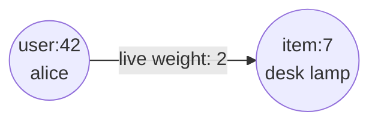
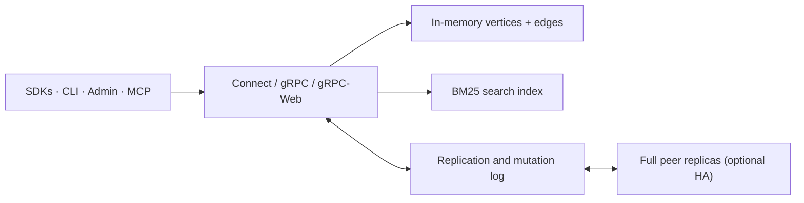

# Lantern — the in-memory Key-Vertex-Store

Lantern is an in-memory database for **live relationships**: typed values live
at keys, directed weighted edges connect them, and both can expire. Read a
value, query its neighborhood, and search its content through the same API.

## Try it locally

You need **Docker, curl, and a POSIX shell**. No checkout, build, or SDK install
is required. Start a released server in one terminal:

```sh
docker run --rm --name lantern-demo \
  -p 127.0.0.1:6380:6380 \
  ghcr.io/anaregdesign/lantern:v0.35.4
```

Once the server starts, paste this into a second terminal:

```sh
rpc() {
  curl -fsS -w '\n' \
    -H 'Content-Type: application/json' \
    -H 'Connect-Protocol-Version: 1' \
    -d "$2" \
    "http://localhost:6380/graph.v1.LanternService/$1"
}

# Store ordinary values at keys.
rpc PutVertex '{"vertex":{"key":"user:42","string":"alice"}}'
rpc PutVertex '{"vertex":{"key":"item:7","string":"desk lamp"}}'
rpc GetVertex '{"key":"item:7"}'

# Two events contribute to the same directed edge: 1.5 + 0.5 = 2.
rpc AddEdge '{"edge":{"tail":"user:42","head":"item:7","weight":1.5}}'
rpc AddEdge '{"edge":{"tail":"user:42","head":"item:7","weight":0.5}}'
rpc GetEdge '{"tail":"user:42","head":"item:7"}'

# Query the neighborhood and search the stored content.
rpc Illuminate '{"seed":"user:42","bfs":{"step":1,"fanOut":10}}'
rpc SearchVertices '{"query":"lamp","limit":10}'
```

You should see `PUT_OUTCOME_APPLIED_AND_LIVE` for both writes, `"desk lamp"`
in the vertex read, and an edge `weight` of **2**. `Illuminate` returns both
vertices and their connecting edge; search returns a hit for `item:7`.

This demo uses local HTTP without auth and omits expiration, so its values
remain until deleted or the container stops. If port `6380` is occupied, change
the host port in `-p` and the matching port in the `rpc` URL. To stop and discard
the demo:

```sh
docker stop lantern-demo
```

Want a browser console instead? The [Docker Compose stack](#deploying)
starts three replicas, the Admin UI, MCP, and Prometheus.

## What makes Lantern different

**Cache semantics apply to the graph itself.** Use Lantern beside your system
of record when the question is “what is related to this key **right now**?”

| Capability | What it gives you |
|---|---|
| **Key/value vertices** | Read and write typed values by key, with optional TTL. No schema registration is required. |
| **Additive, expiring edges** | Each event can add its own weighted contribution and expiration to a relationship. The current weight is the sum of live contributions. |
| **Server-side graph queries** | Bounded BFS, seed-local Personalized PageRank, and local community discovery return graph views. Optional spanning-tree or shortest-path-tree reduction runs on the server. |
| **Full-text search in the same store** | BM25-ranked vertex search supports phrase, fuzzy, prefix-term, and match-mode options; combine search results with graph queries. |
| **One protocol surface** | Connect JSON/protobuf, gRPC, and gRPC-Web share a listener. Use Go, TypeScript, Dart, Rust, the CLI, or plain HTTP. |

The data model is a **weighted directed graph**: a vertex is a key and typed
value; an edge connects an ordered pair of keys. Edges have weights and
expiration, rather than relationship labels or arbitrary property bags.
Your application owns key namespaces and the meaning of weights.


```mermaid
graph LR
    u(("user:42<br/>alice")) -- "live weight: 2" --> i(("item:7<br/>desk lamp"))
```

### Events accumulate; expired contributions drop out

`AddEdge` appends a contribution; `PutEdge` replaces the edge. With TTL-bearing
positive contributions, recent events accumulate and older ones fall out.
Assume both endpoint vertices remain live throughout this example:

```text
t=0  add a → b, weight=1, TTL=3s  → live weight 1
t=1  add a → b, weight=1, TTL=3s  → live weight 2
t=3  first contribution expires  → live weight 1
t=4  last contribution expires   → no live edge
```

Expiration is a **step change**, not continuous decay. SDK `AddDecayingEdge`
helpers approximate a geometric decay curve with staggered expirations.
Reads exclude expired state; background GC reclaims it. TTL is optional per
write: omitting expiration means permanent state for the lifetime of the graph.
An edge is visible only while both endpoint vertices are live. Edge writes
auto-create missing endpoints but do not extend an existing live vertex's TTL.

### Query relationships without fetching the whole graph

The `Illuminate` RPC selects a traversal family and returns the resulting
vertices and edges. The CLI exposes those families directly:

| Query | Example | Use it for |
|---|---|---|
| Bounded BFS | `bfs user:42 2 10` | Explore two hops with bounded fan-out. |
| Personalized PageRank | `pagerank user:42 10` | Rank nearby candidates as a star whose edge weights are PPR scores. |
| Local community | `community user:42 30` | Find a related local group. |

Choose raw, TF-IDF, or BM25 graph weighting, and an optional key-prefix filter.
BFS and community also support `mst` / `spt` reduction with a min/max objective.
See the [Go example](sdks/go/example/main.go), [query complexity guide](docs/illuminate-complexity.md),
and [search contract](docs/search.md) for behavior and bounds. Graph proximity
comes from stored relationships; [it is distinct from embedding similarity](docs/graph-proximity-vs-embeddings.md).

## Where it fits

- **Recommendations and personalization:** user → item events with independent
  TTLs, plus neighborhood queries for current candidates.
- **Fraud and abuse signals:** account, device, and IP co-occurrences that
  accumulate during a time window.
- **Trends and online graph features:** recent interactions available to
  request-time queries instead of waiting for a batch graph rebuild.
- **Shared session or agent context:** short-lived relationships and facts;
  the optional [MCP server](mcp/README.md) exposes presence, claims, activity,
  and a blackboard over Lantern.

Before choosing it, account for these boundaries:

| Boundary | Deployment consequence |
|---|---|
| **In-memory by default** | A restart loses the graph unless you configure recovery. Graph-only snapshots lose writes since the last snapshot; opt-in durable receipt-WAL mode has a separate WAL/backup recovery contract. See [backup and restore](docs/backup.md). |
| **Full replicas, no sharding** | Every HA replica holds the entire graph. The working set must fit in one process's RAM. |
| **Eventual consistency** | Leaderless replication provides HA, with asynchronous propagation between replicas. It is not linearizable; WAN replication is outside the supported scope. See the [replication contract](docs/replication.md). |
| **Local graph queries** | Seed-local traversal and ranking are supported; whole-graph offline analytics are outside the intended workload. |
| **Deployment-wide auth** | Static bearer tokens and TLS/mTLS are available. Per-user or per-namespace ACLs are not. |
| **Pre-v1 API** | Wire schemas, SDK APIs, CLI grammar, env vars, and metrics may break between releases. Pin versions and review upgrades. |

## Use it from your language

| Client | Install | Guide |
|---|---|---|
| Go | `go get github.com/anaregdesign/lantern/sdks/go` | [Go SDK](sdks/go/README.md) |
| TypeScript / Node | `npm install lantern-sdk` | [Node and browser SDK](sdks/node/README.md) |
| Dart / Flutter | `dart pub add lantern_client` | [Dart SDK](sdks/dart/README.md) |
| Rust | `cargo add lantern-client` | [Rust SDK](sdks/rust/README.md) |

SDKs are independently released and differ in supported surface. Their guides
define transport, auth, retry, and receipt contracts.

### Go

The Go SDK is its own module — external projects pull only Connect-Go and
protobuf, nothing from the server:

```shell
go get github.com/anaregdesign/lantern/sdks/go
```

```go
import "github.com/anaregdesign/lantern/sdks/go"

cli, err := client.NewLantern("http://localhost:6380")
if err != nil { log.Fatal(err) }
defer cli.Close()

ctx := context.Background()

// Vertices accept string, int, float, bool, time.Time, time.Duration, []byte, nil.
for _, input := range []struct{ key string; value any }{
    {"user:42", "alice"},
    {"item:7", "desk lamp"},
} {
    outcome, err := cli.PutVertex(ctx, input.key, input.value, time.Hour)
    if err != nil || outcome != client.PutOutcomeAppliedAndLive {
        log.Fatalf("PutVertex %q: outcome=%s err=%v", input.key, outcome, err)
    }
}

// Each AddEdge appends a contribution with its own TTL and returns the live sum.
_, _ = cli.AddEdge(ctx, "user:42", "item:7", 1.0, 30*time.Minute)

// Approximate geometric decay with staggered TTL contributions (one AddEdges RPC).
_, _ = cli.AddDecayingEdge(ctx, "user:42", "item:7",
    client.DecayOpts{InitialWeight: 16, Ratio: 0.5, Steps: 5, Interval: time.Minute})

// Walk: 2 hops, top-3 per hop, TF-IDF weighted.
g, _ := cli.Illuminate(ctx, "user:42",
    client.WithBFS(client.BFSOpts{Step: 2, FanOut: 3}),
    client.WithWeighting(client.WeightingTFIDF))

// Full-text search: BM25-ranked hits over vertex content.
hits, _ := cli.SearchVertices(ctx, "desk lamp", client.WithMatchMode(client.MatchAll))

// Page beyond the per-call limit without collecting an unbounded slice.
for hit, err := range cli.SearchVerticesIter(ctx, "desk lamp",
    client.WithSearchLimit(50), client.WithFullVertex()) {
    if err != nil { log.Fatal(err) }
    fmt.Println(hit.Key, client.StringValue(hit.Vertex))
}

// Prefix scan: enumerate a namespace, auto-paginated.
for batch, err := range cli.ScanVerticesAll(ctx, "user:", 100) {
    if err != nil { log.Fatal(err) }
    for _, v := range batch { fmt.Println(client.StringValue(v)) }
}
```

Use `client.WithAuthToken` for bearer auth, `client.WithRetry` for eligible
reads and unconditional Put, or `client.NewLanternFailover` for opt-in static
endpoint failover. Receipt-less Add and exact/prefix Delete make one attempt;
receipt-backed exact mutations use a separate same-endpoint recovery contract.
See the [SDK guide](sdks/go/README.md) and
[complete example](sdks/go/example/main.go) before choosing retry policies.

### TypeScript / Node

Ships to npm as [`lantern-sdk`](sdks/node/) (ESM + CJS, bundled types,
Node 20+):

```shell
npm install lantern-sdk
```

```ts
import { Objective, Reduction, Weighting, connect } from "lantern-sdk";

const client = connect("http://localhost:6380");
try {
  await client.putVertex({ key: "user:42", value: "alice", ttlSeconds: 3600 });
  await client.putVertex({ key: "item:7", value: "desk lamp", ttlSeconds: 3600 });
  await client.addEdge({ tail: "user:42", head: "item:7", weight: 1.0, ttlSeconds: 1800 });

  const bfs = await client.illuminate("user:42", {
    bfs: {
      step: 2,
      fanOut: 16,
      reduction: Reduction.SHORTEST_PATH_TREE,
      objective: Objective.MAXIMIZE,
    },
    weighting: Weighting.TFIDF,
  });
  const pagerank = await client.illuminate("user:42", {
    ppr: { topN: 16, restartProb: 0.15, epsilon: 0.0001 },
  });
  const community = await client.illuminate("user:42", {
    community: { maxSize: 16, restartProb: 0.15, epsilon: 0.0001 },
  });
  const hits  = await client.searchVertices("desk lamp", { limit: 10 });

  console.log(bfs.vertices.size, pagerank.vertices.size, community.vertices.size);

  for await (const page of client.scanVerticesAll("user:", 500)) {
    for (const v of page) console.log(v.key);
  }
} finally {
  client.close();
}
```

JS values map to typed proto fields (`string`, `number`, `bigint`,
`boolean`, `Date`, `Uint8Array`, `null`, plus explicit numeric wrappers);
ordinary batch writes auto-chunk, while opt-in receipt batches remain
unsplit. The browser build (`lantern-sdk/web`) is what powers the
[admin SPA](admin/). Full API:
[sdks/node/README.md](sdks/node/README.md).
Published Node 0.13.0 includes targeted contribution Delete alongside
the opt-in receipt APIs. See the SDK guide for safe mutation replay.

### Dart / Flutter

[`lantern_client`](https://pub.dev/packages/lantern_client) is a pure-Dart,
Android/iOS-first SDK with immutable values, TTL-preserving Graph results,
CRUD, scans, search, typed traversal, degree ranking, and explicit status.
Its transport owns secure endpoints, token providers, deadlines, cancellation,
bounded retry, typed failures, and auth-exempt Health probing. Published
**0.4.1** includes opt-in receipts and targeted contribution Delete. Start with
the [SDK guide and maintained Flutter example](sdks/dart/README.md).

[`lantern_client_offline`](https://pub.dev/packages/lantern_client_offline) is
an experimental, opt-in Repository layer for cached snapshots, pending
overlays, and foreground replay. Published **0.5.0** adds targeted contribution
Delete to receipt-backed conditional Vertex Put, exact Vertex/Edge Delete,
and explicit-ID Edge Add. It injects a transactional store, keeps credentials
application-owned, respects TTL, and reconciles possibly dispatched writes
status-first. See the [offline guide](sdks/dart/offline/README.md) for the
qualified release contract. The in-memory reference store is test
infrastructure; the [SQLite adapter](sdks/dart/offline_sqlite/README.md) remains
a separate unpublished Flutter package.

### Rust

[`lantern-client`](https://crates.io/crates/lantern-client) targets native Tokio
applications on Linux, macOS, and Windows. Its single-endpoint client supports
trusted HTTPS, private CA/mTLS, per-attempt bearer auth, Health, exact-value/TTL
CRUD, bounded scans/search, typed traversal, degree ranking, and explicit
status. Generated Tonic/Prost clients stay private; building the published crate
needs no proto sources or system `protoc`. See the [crate guide](sdks/rust/README.md)
and [complete secure example](sdks/rust/examples/complete.rs).

### Other clients

Use Connect JSON as in the quickstart, or generate bindings from
[proto/graph/v1/graph.proto](proto/graph/v1/graph.proto) with buf, protoc,
or a [Connect codegen plugin](https://connectrpc.com/docs/). The same listener
accepts Connect, gRPC, and gRPC-Web; Connect JSON also works over HTTP/1.1.

## CLI and browser console

Install a `lantern-cli` binary from a [root release](https://github.com/anaregdesign/lantern/releases),
or use `brew install --cask anaregdesign/tap/lantern-cli` on macOS. The interactive REPL,
verb-first shell commands, and Admin web `/cli` share the same grammar:

```sh
lantern-cli put vertex user:42 "alice" 3600
lantern-cli put vertex item:7 "desk lamp" 3600
lantern-cli add edge user:42 item:7 1.0 1800
lantern-cli bfs user:42 2 10 weighting=tfidf
lantern-cli pagerank user:42 10
lantern-cli community user:42 30
lantern-cli search "desk lamp" mode=all limit=20
lantern-cli repl
```

Use `lantern-cli <cmd> --help` for flags and `help bfs|pagerank|community`
inside the REPL for traversal defaults, bounds, and examples. Reads emit JSON
by default; search also supports NDJSON and TSV. The [Admin UI](admin/README.md)
adds graph visualization, data browsing, search, and operational status.

## API and safe mutation replay

The [protobuf contract](proto/graph/v1/graph.proto) is the full API reference.
Exact reads/writes/deletes have singular and plural forms:

| Surface | Operations |
|---|---|
| Vertices | Get, Put with TTL/conditional outcomes, exact Delete |
| Edges | Get live weight, additive Add, replacement Put, whole-edge Delete, targeted contribution Delete |
| Enumeration | Cursor-paginated vertex/key/edge scans, prefix count, capped prefix Delete with dry-run |
| Queries | Search, `Illuminate` traversal families, degree ranking |
| Operations | Health, server/replication status, backup stream, CDC Subscribe/Snapshot, receipt capability/status |

**Add is not an idempotent write.** A blind retry after a lost response can
add a contribution twice. Supported SDKs provide separate opt-in receipt APIs
for bounded, same-endpoint recovery of exact mutations. Receipt-bearing groups
remain unsplit; Put Edge and prefix Delete have no receipt path. Persist an
explicit contribution ID before Add if you need to retract that contribution
later. See [bounded mutation receipts](docs/decisions/0010-bounded-mutation-receipts.md)
for identity, continuity, status, and retry rules, and each SDK guide for its
published support.

## Deploying

### Docker Compose: cluster and Admin UI

From a repository checkout:

```sh
cd deploy/compose
docker compose up -d --pull always
```

Open **<http://localhost:8080>**. The stack includes three replicas on host
ports `6380`–`6382`, Admin, MCP, and Prometheus on `:9091`. See the
[Compose guide](deploy/compose/README.md) for configuration and cleanup.

### Kubernetes (HA)

```sh
helm install lantern deploy/helm/lantern
```

The chart uses a StatefulSet, DNS peer discovery, anti-entropy reconciliation,
and a PodDisruptionBudget. See [chart values](deploy/helm/lantern/README.md)
and the [HA runbook](docs/ha-runbook.md) for topology, readiness, partitions,
rolling upgrades, and recovery.

### Single instance and images

Leave `LANTERN_PEER_*` unset for a single instance. Choose your recovery mode
using the [backup guide](docs/backup.md). Server, Admin, and MCP images are
published to GHCR with multi-arch builds and cosign signing; the server image
is [`ghcr.io/anaregdesign/lantern`](https://github.com/anaregdesign/lantern/pkgs/container/lantern).

## Configuration and observability

Configuration uses `LANTERN_*` env vars. The [complete generated reference](docs/env.md)
defines defaults, validation, limits, and recovery requirements. Common entries:

| Variable | Default | Purpose |
|---|---|---|
| `LANTERN_PORT` | `6380` | RPC listener |
| `LANTERN_GC_INTERVAL_SECONDS` | `60` | Background cleanup interval |
| `LANTERN_MAX_VERTICES` / `LANTERN_MAX_EDGES` | `0` (unlimited) | Graph-admission soft caps; size causal retention budgets and `GOMEMLIMIT` too |
| `LANTERN_AUTH_TOKENS` | unset | Comma-separated bearer tokens |
| `LANTERN_TLS_CERT_FILE` / `LANTERN_TLS_KEY_FILE` | unset | TLS; `LANTERN_TLS_CLIENT_CA_FILE` enables mTLS |
| `LANTERN_CORS_ALLOWED_ORIGINS` | empty | Browser origin allow-list |
| `LANTERN_RECEIPT_WAL_MODE` | `graph-only` | Default volatile runtime, or configured `fresh` / `restart` durable receipt runtime |
| `LANTERN_METRICS_ADDR` | `:9090` | Prometheus and HTTP health listener |
| `LANTERN_STRICT_CONFIG` | `false` | Reject malformed/unknown config when enabled |

Prometheus metrics, structured JSON logs, gRPC Health and HTTP
`/healthz` / `/readyz`, optional OpenTelemetry tracing, and gRPC reflection
are available. See the [observability guide](docs/observability.md) for setup
and the [HA runbook](docs/ha-runbook.md) for operational signals.

## Architecture and repository


```mermaid
flowchart LR
    C["SDKs · CLI · Admin · MCP"] --> S["Connect / gRPC / gRPC-Web"]
    S --> G["In-memory vertices + edges"]
    S --> I["BM25 search index"]
    S <--> R["Replication and mutation log"]
    R <--> P["Full peer replicas (optional HA)"]
```

The monorepo contains six Go modules joined by [go.work](go.work), independent
Dart/Rust SDKs, and Bun-managed TypeScript packages. The server depends on
`pb` and `core`, independently of client SDKs.

| Path | Role |
|---|---|
| [`proto/`](proto/) / [`pb/`](pb/) | Shared schema / generated Go protobuf and Connect stubs |
| [`core/`](core/) | Graph, cache, collections, concurrency, and NLP building blocks |
| [`server/`](server/) | Server and runtime assembly |
| [`sdks/`](sdks/) | Independently consumable client packages |
| [`cli/`](cli/) / [`admin/`](admin/) / [`mcp/`](mcp/) | CLI, browser console, and agent-facing MCP server |
| [`deploy/`](deploy/) | Compose stack and Helm chart |
| [`docs/`](docs/) | Operational guides and architecture decisions |

## Contributing

Start with [CONTRIBUTING.md](CONTRIBUTING.md) for issue triage, testing, and
release rules, and [AGENTS.md](AGENTS.md) for module boundaries and codegen.
Tests run in each Go submodule as well as the root; Dart, Flutter, Node, and
Rust have their own gates.

[](https://github.com/anaregdesign/lantern/actions/workflows/go.yml)
[](https://pkg.go.dev/github.com/anaregdesign/lantern/sdks/go)
[](https://www.npmjs.com/package/lantern-sdk)
[](https://pub.dev/packages/lantern_client)

## License

[MIT](LICENSE).
