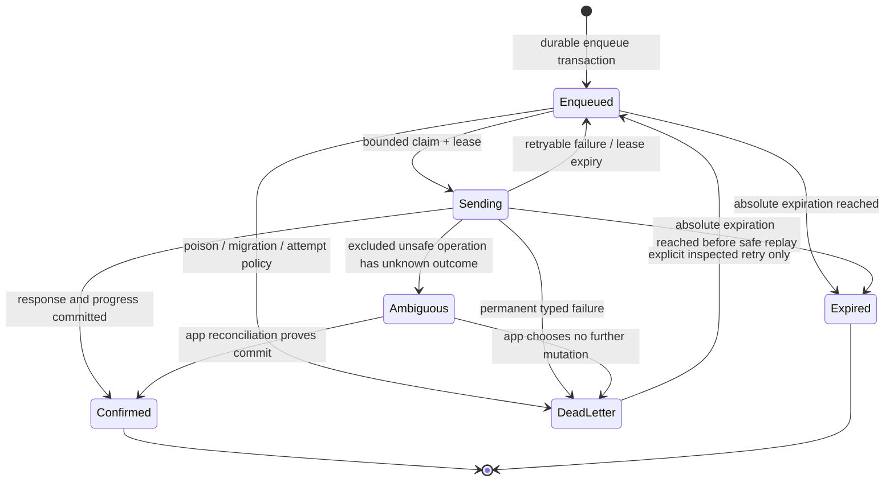

# 0002: Dart offline Repository contract

- Status: Proposed
- Date: 2026-07-12
- Issue: #1021

## Context

`lantern_client` v0.1 is an online, pure-Dart client. Flutter applications may
need locally cached reads or durable mutation replay, but those features cross
boundaries the online client intentionally does not own: database choice,
Keychain/Keystore integration, signed-in tenant partitioning, OS background
work, schema migration, eviction, and product-specific conflict UX.

Lantern also has contracts that make a generic queue unsafe unless it is
designed before the first attempt. Relative TTL becomes one absolute instant;
Add is idempotent only with the same persisted 24-byte contribution ID;
PutIfAbsent and Delete counts change after an ambiguously committed replay;
and a capped prefix Delete can remove a second page if replayed.

Flutter's
[offline-first guidance](https://docs.flutter.dev/app-architecture/design-patterns/offline-first)
places local/remote coordination in an application Repository. The core SDK
must not imply that network-type reachability, lifecycle callbacks, or a token
stored beside a mutation can make delivery durable.

## Decision

Keep `lantern_client` free of an implicit read cache and mutation outbox.
Applications own an opt-in Repository around the SDK and their chosen storage,
identity, encryption, and OS scheduling facilities.

The SDK supplies the online primitives that a Repository needs—immutable exact
values, absolute expiration, caller-supplied contribution IDs, typed errors,
cancellation, and per-call token acquisition—but does not depend on SQLite,
secure storage, connectivity, Flutter, or a state-management library.

An optional `lantern_client_offline` package is deferred. It may be proposed
only after at least two application integrations validate the codec, state
machine, migration, and adapter boundary below. Persistence built directly
into `lantern_client` is rejected: it would force policy and platform
dependencies on every client and make user isolation an SDK-global concern.

## Alternatives

| Boundary | Decision | Reason |
| --- | --- | --- |
| App-owned Repository hooks/examples | Chosen | Keeps policy, identity, encryption, and lifecycle with the application while the online SDK stays pure Dart. |
| Optional `lantern_client_offline` with storage adapter | Deferred | A separate package could be useful, but its codec/migration/API needs production evidence before becoming a maintained contract. |
| Persistence inside `lantern_client` | Rejected | Forces a database and platform policy on all callers, couples logout/encryption to transport, and risks implicit unsafe replay. |

## Read-cache contract

Every record belongs to a non-empty application-defined `partitionId` that
identifies the signed-in user and tenant. A canonical storage key is:

```
lantern-cache / schemaVersion / partitionId / entityKind / entityKey
```

`entityKind` is `vertex` or `edge`. A Vertex key is its UTF-8 key bytes. An
Edge key is the collision-free, length-prefixed UTF-8 pair `(tail, head)`; it
must not be a delimiter-joined string.

Schema v1 preserves every public kind without numeric guessing:

- value discriminator: float64, float32, int32, int64, uint32, uint64, bool,
  string, bytes, timestamp, duration, nil, or unset;
- signed/unsigned 64-bit values encoded as canonical decimal strings;
- float32 stored as its exact IEEE-754 32-bit payload and float64 as 64-bit;
- bytes as raw bytes or canonical base64, never a lossy text conversion;
- timestamp and absolute expiration as UTC microseconds plus a schema tag;
- duration as signed microseconds within the Protobuf duration domain;
- Edge stores tail, head, exact float32 weight, and absolute expiration.

The record also carries `validatedAt`, optional ETag/version metadata supplied
by an application gateway, and its last access time for eviction. A codec must
fail closed on an unknown schema/kind instead of converting it to unset or nil.

Reads return an explicit state:

```dart
sealed class CachedRead<T> {}
final class Fresh<T> extends CachedRead<T> { T value; DateTime validatedAt; }
final class Stale<T> extends CachedRead<T> { T value; DateTime validatedAt; }
final class Missing<T> extends CachedRead<T> { DateTime validatedAt; }
final class Expired<T> extends CachedRead<T> { DateTime expiredAt; }
final class Unknown<T> extends CachedRead<T> { Object? cause; }
```

The actual types will be immutable; fields above are abbreviated API-sketch
notation.

- `Fresh` requires `now < expiration` (when present) and application freshness
  age within its configured bound.
- `Stale` is returned only by an explicitly stale-allowed Repository method
  and still requires `now < expiration`. Stale allowance can never extend a
  Lantern expiration.
- At or after expiration, the Repository deletes/quarantines the payload and
  returns `Expired`, never its value.
- A confirmed remote NotFound/Delete may write a bounded negative `Missing`
  marker. Unknown transport failure is `Unknown`, not `Missing`.
- HA replicas can temporarily disagree. Without a server invalidation/version
  feed, remote Deletes are observed on the next successful revalidation; the
  application chooses a finite maximum stale age based on that risk.

Disk bytes, record count, per-partition bytes, and in-memory decoded objects
all have explicit caps. Writes apply backpressure or evict least-recently-used
read records; they never evict unconfirmed outbox records to make room. A full
outbox rejects new enqueue with a typed capacity error.

Logout transactionally deletes the correct partition's cache, outbox,
dead-letter records, leases, and encryption-key reference before another user
can open it. Applications own at-rest encryption and Keychain/Keystore key
management. The SDK never receives the storage encryption key.

## Mutation-outbox contract

The durable record is committed before the first network attempt. It contains:

```dart
final class OutboxRecord {
  String recordId;              // stable application UUID, not a token
  int schemaVersion;
  String partitionId;
  OfflineIntent intent;         // exact, versioned serialized operation
  DateTime enqueuedAt;
  DateTime? absoluteExpiration; // relative TTL resolved once at enqueue
  String orderingKey;
  int attemptCount;
  DateTime? nextAttemptAt;
  OutboxState state;
  String? leaseOwner;
  DateTime? leaseUntil;
  List<int>? contributionId;    // exact 24 bytes for each Add item
  Set<int> confirmedItems;      // durable per-item/chunk progress
  String? diagnosticCode;       // credential/content-free
}
```

The abbreviated typed operation union initially admits only:

```dart
sealed class OfflineIntent {}
final class PutVerticesIntent extends OfflineIntent {}
final class PutEdgesIntent extends OfflineIntent {}
final class AddEdgesIntent extends OfflineIntent {} // every item has 24-byte ID
```

The payload stores exact input values and resolved absolute expirations, not a
closure or generated request object. Add contribution IDs are generated and
persisted in the same enqueue transaction as the intent. A process restart,
chunk reconstruction, and every retry reuse identical bytes. A relative TTL
is resolved once at enqueue; if `now >= absoluteExpiration` before confirmation,
the record becomes `expired` and is never rebased.

Put is safe to replay to its final state. Add is replayable only when every
remaining item has a persisted valid contribution ID. Confirmed item indexes
are committed after each response so a crash does not rebuild already-finished
non-idempotent work. If an Add response is lost, replaying the same IDs is the
reconciliation; if the server can no longer retain that contribution because
the intent itself expired, the Repository expires the item rather than
minting a new ID.

PutIfAbsent, singular/plural Delete result semantics, and capped prefix Delete
are excluded from the generic outbox. An application-specific workflow may
place one in `ambiguous` only when it also provides a domain reconciliation
screen/API. It can never convert an unknown outcome into `false`, zero, or
success, and no helper loops destructive prefix calls.

Per-key ordering is FIFO by `orderingKey`. A multi-key intent acquires all of
its sorted ordering keys atomically to avoid deadlock; independent keys may run
concurrently up to an application cap. One storage transaction claims a
bounded batch with a lease. After a crash, lease expiry returns `sending` work
to `enqueued`; stable IDs/progress make the next attempt safe.

## State machine



Backoff is full-jitter, bounded, and cancelable. `unavailable` is eligible;
authentication failure pauses the partition for fresh credentials rather than
burning attempts. Resource exhaustion follows explicit app policy. Permanent
invalid argument and unmigratable/corrupt payloads go to dead-letter. Capacity,
maximum attempts/age, lease duration, concurrency, and dead-letter retention
are required constructor configuration, not hidden constants.

Replay starts from an explicit foreground action/resume or after an actual
successful Lantern probe. A network-type plugin may reduce futile attempts but
is never proof of server reachability. iOS suspension and Android Doze make any
background replay best-effort; there is no “delivered after kill” guarantee
without application-owned OS background task or push infrastructure.

## Security and observability threat model

| Threat/failure | Required control |
| --- | --- |
| Token disclosure from disk | Never serialize tokens; call `TokenProvider` at send time and keep auth metadata out of diagnostics. |
| Cross-user/tenant data leak | Partition every key/record; atomically wipe on logout/user switch; do not reuse a partition identifier. |
| Device backup or file extraction | Application chooses encryption and platform key storage; document backup exclusion/rotation policy. |
| Corrupt/tampered record | Authenticated storage where required, strict schema/length/range checks, quarantine/dead-letter without sending. |
| Crash between network commit and local confirmation | Put replays; Add reuses persisted IDs; unsafe conditional/Delete operations remain explicit ambiguous. |
| Crash during migration | Copy-on-write/versioned migration with transaction marker; old schema remains readable until commit or is quarantined. |
| Disk exhaustion/queue flood | Per-partition/global byte and count caps, backpressure, bounded claims, read-cache eviction before outbox loss. |
| Sensitive telemetry | Default metrics expose category, state, age bucket, attempts, counts, and error code only—never keys, values, graph content, IDs, or credentials. |
| Poison item retry loop | Maximum attempts/age, permanent-error classification, application-controlled dead-letter inspect/delete/retry. |
| Logout during send | Cancel partition workers, revoke lease, wipe transactionally, and discard late responses using partition generation/epoch. |

## Golden scenarios

1. **Add crash/replay:** persist an Add with fixed 24-byte IDs, commit remotely,
   lose the response, restart, replay identical bytes, and observe one live
   contribution/effective weight.
2. **Partial batch crash:** confirm chunk/items 0–999, crash before the next
   chunk, restart from persisted progress, and never resend an unsafe confirmed
   item. A stable-ID Add may safely replay an uncertain current chunk.
3. **TTL expires offline:** resolve relative TTL at enqueue, advance past the
   absolute instant, and mark expired without network I/O or TTL rebasing.
4. **Auth rotation:** persist no credential, receive Unauthenticated, pause,
   obtain a new token at send time, then confirm the same record/IDs.
5. **Logout/user switch:** cancel active work, wipe user A's partition and key
   reference, open user B, and prove neither cached values nor outbox metadata
   are observable.
6. **Capped Delete:** generic enqueue rejects the operation before storage or
   network I/O. An application-specific unsafe workflow surfaces ambiguous
   after response loss and never automatically sends a second page.
7. **Expired cached read:** a previously fresh value reaches Lantern absolute
   expiration while offline; even stale-allowed read returns Expired and
   destroys/quarantines the payload.
8. **Corruption/migration:** invalid kind/length/schema never becomes a wire
   request; it is quarantined with a content-free diagnostic and recoverable
   dead-letter action.

## Follow-up scopes after acceptance

Do not open or implement these until this ADR is accepted. Each is intended to
be an independent Issue:

1. Publish storage-neutral v1 cache/outbox codec fixtures and cross-process
   golden tests, without adding persistence to `lantern_client`.
2. Add an application-Repository example using an injected transactional
   store, partition wipe, capacity limits, and fresh/stale/expired states.
3. Prototype a separate `lantern_client_offline` storage-adapter interface and
   replay coordinator behind an experimental version, with crash fault
   injection and no bundled database.
4. Evaluate SQLite and alternative adapters plus Keychain/Keystore integration
   in application space; record production evidence and decide whether the
   optional package graduates.
5. Add foreground-resume replay and dead-letter UI examples, explicitly
   excluding OS background delivery promises.

## Consequences

The online SDK remains deterministic, dependency-light, and honest about what
it can confirm. Applications do more integration work, but they retain control
of identity, storage, encryption, UX, and OS lifecycle. A future helper cannot
silently change TTL, mint an Add ID after enqueue, replay ambiguous Deletes, or
persist credentials; those are now compatibility constraints for any offline
package proposal.
