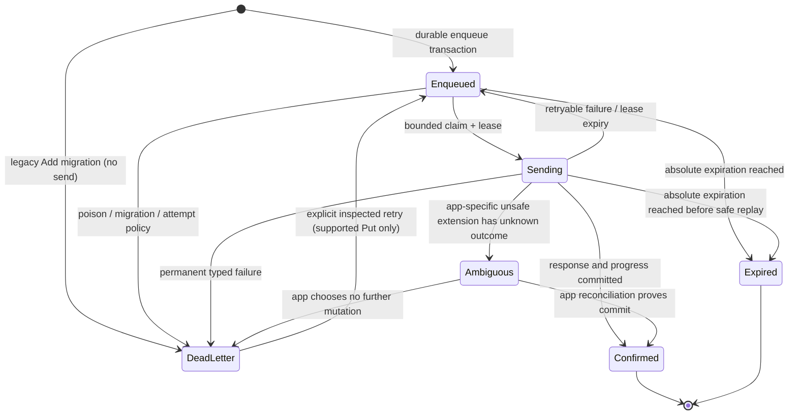

# 0002: Dart offline Repository and package contract

- Status: Accepted; amended to Put-only first release
- Date: 2026-07-12
- Accepted: 2026-07-19
- Amended: 2026-08-11
- Issues: #1021, #1175

## Context

`lantern_client` v0.1 is an online, pure-Dart client. Flutter applications may
need locally cached reads or durable mutation replay, but those features cross
boundaries the online client intentionally does not own: database choice,
Keychain/Keystore integration, signed-in tenant partitioning, OS background
work, schema migration, eviction, and product-specific conflict UX.

Lantern also has contracts that make a generic queue unsafe unless it is
designed before the first attempt. Relative TTL becomes one absolute instant;
Put reaches the same final state when replayed, but a persisted 24-byte
contribution ID alone does not give offline Add a server-authoritative outcome
after response loss and contribution-retention or TTL changes. PutIfAbsent and
Delete counts change after an ambiguously committed replay, and a capped prefix
Delete can remove a second page if replayed.

Flutter's
[offline-first guidance](https://docs.flutter.dev/app-architecture/design-patterns/offline-first)
places local/remote coordination in an application Repository. The core SDK
must not imply that network-type reachability, lifecycle callbacks, or a token
stored beside a mutation can make delivery durable.

## Decision

Keep `lantern_client` free of an implicit read cache and mutation outbox. Ship
an official, opt-in `lantern_client_offline` package that provides the
storage-neutral codec, state machine, cache/outbox engine, and replay
coordinator defined below. Applications compose that package as their
Repository and still own identity, encryption policy, and OS scheduling.

The SDK supplies the online primitives that a Repository needs—immutable exact
values, absolute expiration, caller-supplied contribution IDs, typed errors,
cancellation, and per-call token acquisition—but does not depend on SQLite,
secure storage, connectivity, Flutter, or a state-management library.
Caller-supplied contribution IDs remain part of the direct-online SDK; they do
not make Add part of the durable offline contract.

### Reference-core implementation

The accepted contract now has an experimental pure-Dart reference core at
`sdks/dart/offline` (`lantern_client_offline`, `publish_to: none`). It supplies
the fail-closed cache-v1/outbox-v2 JSON codecs and deterministic fixtures,
immutable public ports/types, a non-production `InMemoryOfflineStore`,
confirmed-cache policy engine, latency-compensated Put overlays, and explicit
bounded replay over an injected `OfflineRemote`. It is intentionally not a
persistence or
encryption implementation.

The first-release core admits only unconditional `PutVertex` and `PutEdge`; it
keeps one outbox record per item plus one content-free durable aggregate per
logical operation, resolves relative TTL once, and rejects late
lease/generation responses after a partition wipe. Calling a
write method means the local transaction committed—not that remote delivery was
confirmed. Replay is foreground-only through explicit `drain`, `start`, or
`resume` calls. The reference store exists for tests and conformance examples;
production adapters must preserve its serializable transaction, defensive-byte,
partition-generation, durable FIFO ordinal, capacity, renewable lease,
operation/dead-letter retention, and codec semantics. They can execute
`runStoreConformanceSuite` in their own test runner against an empty adapter.
The reusable contract also requires globally unique retained operation/record
identities, sealed transaction objects after either commit or rollback,
defensive byte ownership, bounded notification resources, and indexed bounded
deadline queries used by lazy expiration.

The package has no storage key API and makes no encryption claim. Applications
must provide at-rest encryption and key lifecycle policy in their store adapter.
Schema open/migration failures must fail closed as `OfflineSchemaException`;
malformed record bytes or v1/v2/v3/v4/v5 reference snapshots must fail closed as
`OfflineCodecException` and must never be sent to `OfflineRemote`. Reference
snapshot schema v5 persists the exact dead-letter transition time, operation
aggregates, and durable auth pause. Opening schema v1, v2, or v3 quarantines
legacy Add as an inspectable terminal `unsupported_add` dead letter and applies
a conservative dead-letter transition-time fallback; schema v4 and later fail
closed on Add. Opening schema v1-v4 recovers auth pause from durable operation
metadata. Schema v1 also reconstructs active operation metadata and marks
outcomes no longer present in the legacy outbox as `outcomeUnknown`. Cache and
outbox capacity failures use
`OfflineCapacityException`; adapters may evict only confirmed cache records,
never live unconfirmed outbox records.
Restore validates the complete record/operation/ordinal/generation/lease/state
graph before exposing it; duplicate record identities or contradictory status
metadata fail closed.

`lantern_client_offline` takes an injected transactional `OfflineStore`; it
does not bundle a database. The storage-neutral contract graduates only after
its deterministic host gates are paired with the maintained example on at least
one physical Android or iOS device. A separately versioned production adapter
may be proposed later after passing the reusable conformance suite; no default
adapter or package publication is implied by core graduation. Persistence built
directly into `lantern_client` remains rejected: it would force policy and
platform dependencies on every client and make user isolation an SDK-global
concern.

## Alternatives

| Boundary | Decision | Reason |
| --- | --- | --- |
| App-owned Repository hooks/examples only | Rejected as the final product boundary | Preserves maximum flexibility but makes every mobile application rebuild the same crash-sensitive sync engine. Examples remain valuable for integration and policy ownership. |
| Official opt-in `lantern_client_offline` with storage adapter | Chosen | Provides Firestore-like offline ergonomics while keeping persistence opt-in and the online SDK pure Dart. Experimental status makes the evidence gate explicit. |
| Persistence inside `lantern_client` | Rejected | Forces a database and platform policy on all callers, couples logout/encryption to transport, and risks implicit unsafe replay. |

## Read-cache contract

Every record belongs to a non-empty application-defined `partitionId` that
identifies the signed-in user and tenant. A canonical storage key is:

```
lantern-cache / schemaVersion / partitionId / entityKind / entityKey
```

`entityKind` is `vertex` or `edge`. A Vertex key is its UTF-8 key bytes. An
Edge key is the collision-free, length-prefixed UTF-8 pair `(tail, head)`; it
must not be a delimiter-joined string.

Schema v1 preserves every public kind without numeric guessing:

- value discriminator: float64, float32, int32, int64, uint32, uint64, bool,
  string, bytes, timestamp, duration, nil, or unset;
- signed/unsigned 64-bit values encoded as canonical decimal strings;
- float32 stored as its exact IEEE-754 32-bit payload and float64 as 64-bit;
- bytes as raw bytes or canonical base64, never a lossy text conversion;
- timestamp and absolute expiration as UTC microseconds plus a schema tag;
- duration as signed microseconds within the Protobuf duration domain;
- Edge stores tail, head, exact float32 weight, and absolute expiration.

The record also carries `validatedAt`, optional ETag/version metadata supplied
by an application gateway, and its last access time for eviction. A codec must
fail closed on an unknown schema/kind instead of converting it to unset or nil.

Reads return an immutable snapshot with an explicit state:

```dart
enum OfflineReadState { fresh, stale, missing, expired, unknown }

final class OfflineSnapshot<T> {
  OfflineReadState state;
  OfflineReadSource? source;
  T? value;
  DateTime? validatedAt;
  bool hasPendingWrites;
}
```

Fields above are abbreviated API-sketch notation; the implemented type is
immutable. Cache-first watches emit local state immediately, attempt one server
revalidation, coalesce identical snapshots, and remain subscribed to local
changes even when that revalidation fails.

- `Fresh` requires `now < expiration` (when present) and application freshness
  age within its configured bound.
- `Stale` is returned only by an explicitly stale-allowed Repository method
  and still requires `now < expiration`. Stale allowance can never extend a
  Lantern expiration.
- At or after expiration, the Repository deletes/quarantines the payload and
  returns `Expired`, never its value.
- A confirmed remote NotFound/Delete may write a bounded negative `Missing`
  marker. Unknown transport failure is `Unknown`, not `Missing`.
- HA replicas can temporarily disagree. Without a server invalidation/version
  feed, remote Deletes are observed on the next successful revalidation; the
  application chooses a finite maximum stale age based on that risk.

Disk bytes, record count, per-partition bytes, and in-memory decoded objects
all have explicit caps. Writes apply backpressure or evict least-recently-used
read records; they never evict unconfirmed outbox records to make room. A full
outbox rejects new enqueue with a typed capacity error.

Logout transactionally deletes the correct partition's cache, outbox,
dead-letter records, leases, and encryption-key reference before another user
can open it. Applications own at-rest encryption and Keychain/Keystore key
management. The SDK never receives the storage encryption key.

## Mutation-outbox contract

The durable record is committed before the first network attempt. One record
represents one mutation item; a plural application call commits one record per
item in a single enqueue transaction. Records from that call share an
`operationId` and have stable, zero-based `itemIndex` values. This makes
per-item progress durable without inventing a terminal state for a batch whose
items have mixed confirmation or expiration outcomes.

The same transaction also creates or updates a content-free operation
aggregate. `getWriteStatus` and `watchWrite` reconstruct its latest per-item
states after process restart; the process-local handle stream is only a
convenience. Enqueue, claim, confirmation, retry, authentication pause,
dead-letter, expiry, and lease recovery update outbox and aggregate metadata
atomically. Terminal aggregates have bounded retention and may be evicted;
non-terminal aggregates may not be evicted to admit new work.
Operation and record IDs remain unique across both live outbox and retained
aggregate metadata. Caller collisions fail atomically; generated IDs retry only
within an explicit bound and then fail without replacing previous intent.

The storage model contains:

```dart
final class OutboxRecord {
  String recordId;              // stable application UUID, not a token
  String operationId;           // stable logical-call UUID for batch grouping
  int itemIndex;
  int schemaVersion;
  String partitionId;
  OfflineIntent intent;         // exact, versioned serialized single-item intent
  DateTime enqueuedAt;
  DateTime? absoluteExpiration; // relative TTL resolved once at enqueue
  String orderingKey;
  int attemptCount;
  DateTime? nextAttemptAt;
  OutboxState state;
  String? leaseOwner;
  DateTime? leaseUntil;
  DateTime? deadLetteredAt;     // exact transition used for retention
  String? diagnosticCode;       // credential/content-free
}
```

The active abbreviated typed operation union admits only single-item Put
intents:

```dart
sealed class OfflineIntent {}
final class PutVertexIntent extends OfflineIntent {}
final class PutEdgeIntent extends OfflineIntent {}
```

The payload stores the exact input value, including its wire kind and float
payload, plus the resolved absolute expiration; it is not a closure or a
generated request object. Enqueue samples the clock once per logical call and
resolves each item's relative TTL against that instant before committing all
records. If `now >= absoluteExpiration` before confirmation, that item becomes
`expired` and is never rebased.

Put is safe to replay to its final state. The coordinator may batch compatible
records as a future transport optimization, but the accepted baseline sends
one item per RPC and commits each record's resulting state transactionally
after its response. A 1,001-item restart scenario proves that already-confirmed
items are not replayed while remaining Put items resume safely. A crash
therefore does not rebuild already-confirmed items into a later batch.

The codec retains `AddEdgeIntent` and its exact contribution ID only to read
snapshots produced by the earlier experimental implementation. Snapshot open
and replay both fail closed: the item becomes terminal `deadLetter` with
diagnostic `unsupported_add`, its attempt count is unchanged, no pending read
overlay is produced, and `OfflineRemote` has no Add method. Authorized
inspection and deletion remain available; generic retry returns
`OfflineUnsupportedOperationException` instead of sending it. Add can re-enter
the durable public API only after #1115 defines server-authoritative operation
receipts and the offline package proves receipt-based TTL, response-loss,
restart, and conformance behavior.

PutIfAbsent, singular/plural Delete result semantics, and capped prefix Delete
are excluded from the generic outbox. An application-specific workflow may
place one in `ambiguous` only when it also provides a domain reconciliation
screen/API. It can never convert an unknown outcome into `false`, zero, or
success, and no helper loops destructive prefix calls.

Per-key ordering is FIFO by `orderingKey`; a Vertex uses its key and an Edge
uses its collision-free length-prefixed `(tail, head)` identity. A logical
plural call does not create a global ordering barrier: independent keys may run
concurrently up to an application cap, while records for the same key remain
ordered by enqueue sequence. One storage transaction claims a bounded set of
compatible records with leases. After a crash, lease expiry returns `sending`
work to `enqueued`; stable IDs and per-record states make the next attempt safe.
While an RPC remains active, the coordinator renews its lease with an
owner/generation/state CAS. A lost lease makes the late response ineligible for
local confirmation.

Distinct remote reads have repository-wide and per-partition active and queued
caps. Snapshot watchers have repository-wide, per-partition, and active
partition caps. A separate active partition-runtime cap bounds concurrent
unique-partition work before its process-local lifecycle map grows; runtimes
are evicted when they have no active or queued work. Remote and watcher bounds
apply only to remote legs and active subscriptions; cache-only reads remain
local, and queued cancellation cannot start a remote request.

The offline package exposes a control surface that lets the application make
unsafe and failed work inspectable without exposing payloads through logs.
Names are illustrative, but the typed capabilities are required:

```dart
abstract interface class OfflineRepositoryControl {
  Future<List<DeadLetterSummary>> listDeadLetters(String partitionId);
  Future<void> deleteDeadLetter(String partitionId, String recordId);
  Future<void> retryDeadLetter(String partitionId, String recordId);
  Future<void> resolveAmbiguous(
    String partitionId,
    String recordId,
    AmbiguousResolution resolution,
  );
  Future<void> wipePartition(String partitionId);
}
```

`DeadLetterSummary` exposes only record ID, operation category, state, age,
attempt count, and diagnostic code by default. Reading the sensitive intent is
a separate application-authorized action. `resolveAmbiguous` exists only for
an application-specific unsafe workflow with domain reconciliation; the
generic Put-only outbox neither accepts unsafe intents nor fabricates an
outcome.

## State machine



Backoff is full-jitter, bounded, and cancelable. `unavailable` is eligible;
authentication failure pauses the partition for fresh credentials rather than
burning attempts. Resource exhaustion follows explicit app policy. Permanent
invalid argument and unmigratable/corrupt payloads go to dead-letter. Capacity,
maximum attempts/age, lease duration, concurrency, and dead-letter retention
are required constructor configuration, not hidden constants.
Public reads, status/watch, recovery controls, enqueue, and replay perform a
bounded lazy sweep. Store adapters provide deadline indexes scoped by partition,
operation, and entity so a due record is found without linearly scanning live
FIFO predecessors. Expired records stop consuming unconfirmed capacity, and
dead-letter retention starts at `deadLetteredAt`, not original enqueue.

Replay starts from an explicit foreground action/resume or after an actual
successful Lantern probe. A network-type plugin may reduce futile attempts but
is never proof of server reachability. iOS suspension and Android Doze make any
background replay best-effort; there is no “delivered after kill” guarantee
without application-owned OS background task or push infrastructure.

Every replay entry point joins one per-partition serialized lifecycle and one
repository-wide/per-partition send limiter. Durable sends suppress the online
client's retry policy; each singular adapter send therefore attempts at most one
RPC, and every `attemptCount` increment maps to one RPC rather than hidden nested
attempts. An
Unauthenticated outcome atomically sets partition-level durable pause metadata;
the partition auth epoch cancels same-batch sibling token acquisition before
another send starts. Ordinary drain/start/probe paths cannot clear the pause or
acquire another token.
After credentials rotate, only explicit `resume` clears the pause.
Offline backoff is a durable `nextAttemptAt` eligibility boundary, not a live
per-record Timer; canceling foreground work therefore leaves no sleeping worker.

`partitionId` is exclusively a local persistence namespace and never crosses
the Lantern wire; it is not a server tenant, identity, or authorization
boundary. Logout first marks the partition runtime closing, then cancels and
awaits its token acquisition, reads, sends, probes, lease renewal, and watchers,
and only then wipes local state and advances generation. Credentials may rotate
after that Future completes. A server-accepted mutation cannot be recalled, so
the guarantee is local isolation and no further send—not remote rollback.
Repository disposal follows the same quiescence rule for every partition.

## Security and observability threat model

| Threat/failure | Required control |
| --- | --- |
| Token disclosure from disk | Never serialize tokens; call `TokenProvider` at send time and keep auth metadata out of diagnostics. |
| Cross-user/tenant data leak | Partition every key/record; atomically wipe on logout/user switch; do not reuse a partition identifier. |
| Device backup or file extraction | Application chooses encryption and platform key storage; document backup exclusion/rotation policy. |
| Corrupt/tampered record | Authenticated storage where required, strict schema/length/range checks, quarantine/dead-letter without sending. |
| Crash between network commit and local confirmation | Put replays to the same final state; Add remains outside the offline API until server-authoritative receipts exist; unsafe conditional/Delete operations remain explicit ambiguous. |
| Crash during migration | Copy-on-write/versioned migration with transaction marker; old schema remains readable until commit or is quarantined. |
| Disk exhaustion/queue flood | Per-partition/global byte and count caps, backpressure, bounded claims, read-cache eviction before outbox loss. |
| Sensitive telemetry | Default metrics expose category, state, age bucket, attempts, counts, and error code only—never keys, values, graph content, IDs, or credentials. |
| Poison item retry loop | Maximum attempts/age, permanent-error classification, application-controlled dead-letter inspect/delete/retry. |
| Logout during send | Cancel partition workers, revoke lease, wipe transactionally, and discard late responses using partition generation/epoch. |

## Golden scenarios

1. **Put crash/replay:** commit a Put remotely, lose the response, restart, and
   replay to the same exact value and absolute expiration.
2. **Partial batch crash:** confirm items 0–999, crash before the next item,
   restart from persisted progress, and resume the remaining Put items without
   resending confirmed work.
3. **TTL expires offline:** resolve relative TTL at enqueue, advance past the
   absolute instant, and mark expired without network I/O or TTL rebasing.
4. **Auth rotation:** persist no credential, receive Unauthenticated, pause,
   obtain a new token at send time, then confirm the same record/IDs.
5. **Logout/user switch:** cancel active work, wipe user A's partition and key
   reference, open user B, and prove neither cached values nor outbox metadata
   are observable.
6. **Capped Delete:** generic enqueue rejects the operation before storage or
   network I/O. An application-specific unsafe workflow surfaces ambiguous
   after response loss and never automatically sends a second page.
7. **Expired cached read:** a previously fresh value reaches Lantern absolute
   expiration while offline; even stale-allowed read returns Expired and
   destroys/quarantines the payload.
8. **Corruption/migration:** invalid kind/length/schema never becomes a wire
   request. A legacy Add from a v1/v2 snapshot becomes an inspectable terminal
   `unsupported_add` dead letter with attempt count unchanged and zero remote
   calls, while supported Put siblings in the same operation still replay.
9. **Idle expiry at scale:** with more records than one sweep limit and only a
   late operation item due, a status/watch observation reaches that item through
   the deadline index, persists `Expired`, reclaims outbox capacity, and closes
   a terminal aggregate without a drain.
10. **Identity/transaction misuse:** retained operation or record collisions
    never replace intent, generated-ID exhaustion is atomic, and a transaction
    escaped from either a committed or rolled-back callback rejects every read
    and mutation.

## Follow-up scopes

Each scope is an independent Issue. Later scopes may use evidence or artifacts
from an earlier scope, but none may add implicit persistence to
`lantern_client`:

1. [#1111](https://github.com/anaregdesign/lantern/issues/1111) publishes
   storage-neutral v1 cache/outbox codec fixtures and cross-process golden
   tests, without adding persistence to `lantern_client`.
2. [#1112](https://github.com/anaregdesign/lantern/issues/1112) implements the
   experimental `lantern_client_offline` package with an injected transactional
   store, partition wipe, capacity limits, and fresh/stale/expired states.
3. [#1113](https://github.com/anaregdesign/lantern/issues/1113) adds a maintained
   Flutter integration with foreground-resume replay and dead-letter controls,
   excluding OS background delivery promises.
4. [#1114](https://github.com/anaregdesign/lantern/issues/1114) combines the
   storage-neutral crash/conformance gates with the maintained example running
   on at least one physical Android or iOS device, then decides whether the
   package contract is ready for separate release planning. Production adapter,
   Keychain/Keystore, and publication work remain separate follow-up scopes.
5. [#1115](https://github.com/anaregdesign/lantern/issues/1115) adds
   server-authoritative operation receipts so mutations whose public result is
   ambiguous after response loss can be reconciled safely. Offline Add remains
   disabled until those receipts define authoritative TTL/outcome semantics and
   the offline package adds response-loss, restart, and conformance evidence.
6. [#1116](https://github.com/anaregdesign/lantern/issues/1116) adds a
   client-facing revision/change stream for explicit mutations and HA
   convergence. It does not synthesize an event when TTL expires.
7. [#1162](https://github.com/anaregdesign/lantern/issues/1162) owns hosted
   dependency conversion, versioning, pub.dev OIDC, and the independent
   `sdks/dart/offline/vX.Y.Z` release contract.
8. [#1163](https://github.com/anaregdesign/lantern/issues/1163) implements a
   separately versioned production SQLite adapter and runs the reusable store
   conformance suite plus physical restart/isolation checks.

## Consequences

The online SDK remains deterministic, dependency-light, and honest about what
it can confirm. The official offline package removes repeated sync-engine work
without taking ownership of application identity, encryption, UX, or OS
lifecycle. It cannot silently change TTL, send a legacy Add, replay ambiguous
Deletes, or persist credentials; those are compatibility constraints for every
offline-package version. Direct-online Add remains available in
`lantern_client`; durable offline Add is deferred to the #1115 receipt contract.
